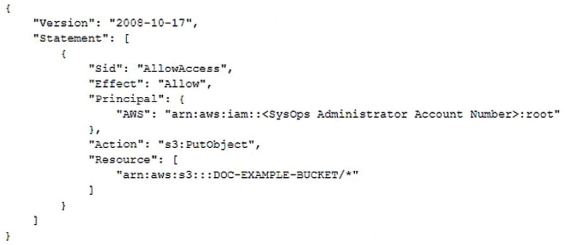
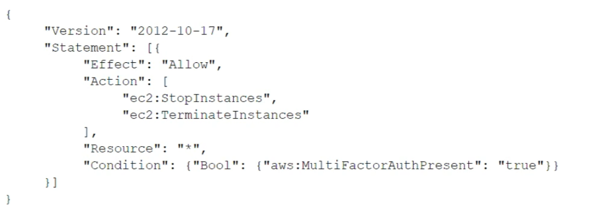

# AWS CloudOps Engineer Associate (SOA-C03) — Answers

Correct answers for the AWS Certified CloudOps Engineer Associate (SOA-C03) practice question bank. Pair with `CloudOps_SOA-C03_Questions.md`.

**Total Questions:** 398

> The source material does not include worked explanations for this exam's question bank — only the correct option(s) are marked.

---

## Question 1

An Amazon EC2 instance needs to be reachable from the internet. The EC2 instance is in a subnet with the following route table. Which entry must a CloudOps Engineer add to the route table to meet this requirement?

**Answer:** C) A route for `0.0.0.0/0` that points to an internet gateway.

---

## Question 2

A CloudOps Engineer launches an Amazon EC2 instance in a private subnet of a `VPC`. When the CloudOps Engineer attempts a `curl` command from the command line of the EC2 instance, the CloudOps Engineer cannot connect to `https:www.example.com`. What should the CloudOps Engineer do to resolve this issue?

**Answer:** A) Ensure that there is an outbound security group for port `443` to `0.0.0.0/0`.

---

## Question 3

A company's public website is hosted in an Amazon S3 bucket in the `us-east-1` Region behind an Amazon CloudFront distribution. The company wants to ensure that the website is protected from DDoS attacks. A CloudOps Engineer needs to deploy a solution that gives the company the ability to maintain control over the rate limit at which DDoS protections are applied. Which solution will meet these requirements?

**Answer:** A) Deploy a global-scoped AWS WAF web `ACL` with an allow default action. Configure an AWS WAF rate-based rule to block matching traffic. Associate the web `ACL` with the CloudFront distribution.

---

## Question 4

A company hosts an online shopping portal in the AWS Cloud. The portal provides `HTTPS` security by using a TLS certificate on an Elastic Load Balancer (ELB). Recently, the portal suffered an outage because the TLS certificate expired. A CloudOps Engineer must create a solution to automatically renew certificates to avoid this issue in the future. What is the MOST operationally efficient solution that meets these requirements?

**Answer:** B) Request a public certificate by using AWS Certificate Manager (ACM). Associate the certificate from ACM with the ELB. ACM will automatically manage the renewal of the certificate.

---

## Question 5

With the threat of ransomware viruses encrypting and holding company data hostage, which action should be taken to protect an Amazon S3 bucket?

**Answer:** B) Enable server-side encryption on the bucket.

---

## Question 6

A company is partnering with an external vendor to provide data processing services. For this integration, the vendor must host the company's data in an Amazon S3 bucket in the vendor's AWS account. The vendor is allowing the company to provide an AWS Key Management Service (AWS KMS) key to encrypt the company's data. The vendor has provided an IAM role Amazon Resources Name (ARN) to the company for this integration. What should a CloudOps Engineer do to configure this integration?

**Answer:** A) Create a new KMS key. Add the vendor's IAM role ARN to the KMS key policy. Provide the new KMS key ARN to the vendor.

---

## Question 7

A database is running on an Amazon RDS Multi-AZ DB instance. A recent security audit found the database to be out of compliance because it was not encrypted. Which approach will resolve the encryption requirement?

**Answer:** D) Take a snapshot of the RDS instance, copy and encrypt the snapshot, and then restore to the new RDS instance.

---

## Question 8

A CloudOps Engineer receives an alert from Amazon GuardDuty about suspicious network activity on an Amazon EC2 instance. The GuardDuty finding lists a new external IP address as a traffic destination. The CloudOps Engineer does not recognize the external IP address. The CloudOps Engineer must block traffic to the external IP address that GuardDuty identified Which solution will meet this requirement?

**Answer:** C) Create a network `ACL`. Add an outbound deny rule for traffic to the external IP address.

---

## Question 9

A web application runs on Amazon EC2 instances behind an Application Load Balancer (ALB). The instances run in an Auto Scaling group across multiple Availability Zones. A CloudOps Engineer notices that some of these EC2 instances show up as healthy in the Auto Scaling group but show up as unhealthy in the `ALB` target group. What is a possible reason for this issue?

**Answer:** D) The target group health check is configured with an incorrect port or path.

---

## Question 10

A CloudOps Engineer has enabled AWS CloudTrail in an AWS account. If CloudTrail is disabled, it must be re-enabled immediately. What should the CloudOps Engineer do to meet these requirements WITHOUT writing custom code?

**Answer:** B) Create an AWS Config rule that is invoked when CloudTrail configuration changes.

---

## Question 11

A CloudOps Engineer needs to give users the ability to upload objects to an Amazon S3 bucket. The CloudOps Engineer creates a presigned URL and provides the URL to a user, but the user cannot upload an object to the S3 bucket. The presigned URL has not expired, and no bucket policy is applied to the S3 bucket. Which of the following could be the cause of this problem?

**Answer:** B) The CloudOps Engineer does not have the necessary permissions to upload the object to the S3 bucket.

---

## Question 12

A company runs a web application on three Amazon EC2 instances behind an Application Load Balancer (ALB). The company notices that random periods of increased traffic cause a degradation in the application's performance. A CloudOps Engineer must scale the application to meet the increased traffic. Which solution meets these requirements?

**Answer:** C) Deploy the application to an Auto Scaling group of EC2 instances with a target tracking scaling policy. Attach the `ALB` to the Auto Scaling group.

---

## Question 13

A company uses an Amazon Elastic File System (Amazon EFS) file system to share files across many Linux Amazon EC2 instances. A CloudOps Engineer notices that the file system's `PercentIOLimit` metric is consistently at `100%` for 15 minutes or longer. The CloudOps Engineer also notices that the application that reads and writes to that file system is performing poorly. They application requires high throughput and IOPS while accessing the file system. What should the CloudOps Engineer do to remediate the consistently high `PercentIOLimit` metric?

**Answer:** D) Modify the existing EFS file system and activate `Provisioned Throughput` mode.

---

## Question 14

A company needs to restrict access to an Amazon S3 bucket to Amazon EC2 instances in a `VPC` only. All traffic must be over the AWS private network. What actions should the CloudOps Engineer take to meet these requirements?

**Answer:** B) Create a `VPC` endpoint for the S3 bucket, and create a S3 bucket policy that conditionally limits all S3 actions on the bucket to the `VPC` endpoint as the source.

---

## Question 15

A company is managing multiple AWS accounts in AWS Organizations. The company is reviewing internal security of its AWS environment. The company's security engineer has their own AWS account and wants to review the `VPC` configuration of developer AWS accounts. Which solution will meet these requirements in the MOST secure manner?

**Answer:** D) Create an IAM policy in each developer account that has read-only access related to `VPC` resources. Assign the policy to a cross-account IAM role. Ask the security engineer to assume the role from their account.

---

## Question 16

A company migrated an I/O intensive application to an Amazon EC2 general purpose instance. The EC2 instance has a single General Purpose SSD Amazon Elastic Block Store (Amazon EBS) volume attached. Application users report that certain actions that require intensive reading and writing to the disk are taking much longer than normal or are failing completely. After reviewing the performance metrics of the EBS volume, a CloudOps Engineer notices that the `VolumeQueueLength` metric is consistently high during the same times in which the users are reporting issues. The CloudOps Engineer needs to resolve this problem to restore full performance to the application. Which action will meet these requirements?

**Answer:** C) Modify the volume properties to increase the IOPS.

---

## Question 17

A company has multiple AWS Site-to-Site `VPN` connections between a `VPC` and its branch offices. The company manages an Amazon Elasticsearch Service (Amazon ES) domain that is configured with public access. The Amazon ES domain has an open domain access policy. A CloudOps Engineer needs to ensure that Amazon ES can be accessed only from the branch offices while preserving existing data. Which solution will meet these requirements?

**Answer:** B) Configure an IP-based domain access policy on Amazon ES. Add an allow statement to the policy that includes the private IP `CIDR` blocks from each branch office network.

---

## Question 18

A company is managing many accounts by using a single organization in AWS Organizations. The organization has all features enabled. The company wants to turn on AWS Config in all the accounts of the organization and in all AWS Regions. What should a CloudOps Engineer do to meet these requirements in the MOST operationally efficient way?

**Answer:** A) Use AWS CloudFormation `StackSets` to deploy stack instances that turn on AWS Config in all accounts and in all Regions.

---

## Question 19

A company's CloudOps Engineer deploys four new Amazon EC2 instances by using the standard Amazon Linux 2 Amazon Machine Image (AMI). The company needs to be able to use AWS Systems Manager to manage the instances The CloudOps Engineer notices that the instances do not appear in the Systems Manager console. What must the CloudOps Engineer do to resolve this issue?

**Answer:** D) Attach an IAM instance profile to the instances. Ensure that the instance profile contains the `AmazonSSMManagedinstanceCore` policy.

---

## Question 20

A development team recently deployed a new version of a web application to production. After the release, penetration testing revealed a cross-site scripting vulnerability that could expose user data. Which AWS service will mitigate this issue?

**Answer:** B) AWS WAF.

---

## Question 21

An Amazon EC2 instance is running an application that uses Amazon Simple Queue Service (Amazon SQS) queues. A CloudOps Engineer must ensure that the application can read, write, and delete messages from the SQS queues. Which solution will meet these requirements in the MOST secure manner?

**Answer:** D) Create and associate an IAM role that allows EC2 instances to call AWS services. Attach an IAM policy to the role that allows the `sqs:SendMessage` permission, the `sqs:ReceiveMessage` permission, and the `sqs:DeleteMessage` permission to the appropriate queues.

---

## Question 22

A company has a policy that requires all Amazon EC2 instances to have a specific set of tags. If an EC2 instance does not have the required tags, the noncompliant instance should be terminated. What is the MOST operationally efficient solution that meets these requirements?

**Answer:** D) Create an AWS Config rule to check if the required tags are present. If an EC2 instance is noncompliant, invoke an AWS Systems Manager Automation document to terminate the instance.

---

## Question 23

A CloudOps Engineer wants to upload a file that is 1 TB in size from on-premises to an Amazon S3 bucket using multipart uploads. What should the CloudOps Engineer do to meet this requirement?

**Answer:** D) Use the `s3 cp` command.

---

## Question 24

A CloudOps Engineer launches an Amazon EC2 Linux instance in a public subnet. When the instance is running, the CloudOps Engineer obtains the public IP address and attempts to remotely connect to the instance multiple times. However, the CloudOps Engineer always receives a timeout error. Which action will allow the CloudOps Engineer to remotely connect to the instance?

**Answer:** C) Modify the instance security group to allow inbound `SSH` traffic from the CloudOps Engineer's IP address.

---

## Question 25

A company wants to use only IPv6 for all its Amazon EC2 instances. The EC2 instances must not be accessible from the internet, but the EC2 instances must be able to access the internet. The company creates a dual-stack `VPC` and IPv6-only subnets. How should a CloudOps Engineer configure the `VPC` to meet these requirements?

**Answer:** C) Create and attach an egress-only internet gateway. Create a custom route table that includes an entry to point all IPv6 traffic to the egress-only internet gateway. Attach the custom route table to the IPv6-only subnets.

---

## Question 26

A CloudOps Engineer wants to manage a web server application with AWS Elastic Beanstalk. The Elastic Beanstalk service must maintain full capacity for new deployments at all times. Which deployment policies satisfy this requirement? (Select TWO.)

**Answer:**
- B) Immutable.
- E) Rolling with additional batch.

---

## Question 27

A company asks a CloudOps Engineer to ensure that AWS CloudTrail files are not tampered with after they are created. Currently, the company uses AWS Identity and Access Management (IAM) to restrict access to specific trails. The company's security team needs the ability to trace the integrity of each file. What is the MOST operationally efficient solution that meets these requirements?

**Answer:** D) Enable the CloudTrail file integrity feature on the trail. The security team can use the digest file that is created by CloudTrail to verify the integrity of the delivered files.

---

## Question 28

A company has multiple Amazon EC2 instances that run a resource-intensive application in a development environment. A CloudOps Engineer is implementing a solution to stop these EC2 instances when they are not in use. Which solution will meet this requirement?

**Answer:** B) Create an Amazon CloudWatch alarm to stop the EC2 instances when the average CPU utilization is lower than `5%` for a 30-minute period.

---

## Question 29

A company creates custom AMI images by launching new Amazon EC2 instances from an AWS CloudFormation template it installs and configure necessary software through AWS OpsWorks and takes images of each EC2 instance. The process of installing and configuring software can take between 2 to 3 hours but at times the process stalls due to installation errors. The CloudOps Engineer must modify the CloudFormation template so if the process stalls, the entire stack will fail and roll back. Based on these requirements what should be added to the template?

**Answer:** B) `CreationPolicy` with timeout set to 4 hours.

---

## Question 30

A company plans to run a public web application on Amazon EC2 instances behind an Elastic Load Balancer (ELB). The company's security team wants to protect the website by using AWS Certificate Manager (ACM) certificates. The ELB must automatically redirect any `HTTP` requests to `HTTPS`. Which solution will meet these requirements?

**Answer:** B) Create an Application Load Balancer that has one `HTTP` listener on port `80` and one `HTTPS` protocol listener on port `443`. Attach an SSL/TLS certificate to listener port `443`. Create a rule to redirect requests from port `80` to port `443`.

---

## Question 31

A CloudOps Engineer is responsible for a legacy CPU-heavy application. The application can only be scaled vertically. Currently, the application is deployed on a single t2 large Amazon EC2 instance. The system is showing `90%` CPU usage and significant performance latency after a few minutes. What change should be made to alleviate the performance problem?

**Answer:** B) Upgrade to a compute-optimized instance.

---

## Question 32

A company recently migrated its application to a `VPC` on AWS. An AWS Site-to-Site `VPN` connection connects the company's on-premises network to the `VPC`. The application retrieves customer data from another system that resides on premises. The application uses an on-premises `DNS` server to resolve domain records. After the migration, the application is not able to connect to the customer data because of name resolution errors. Which solution will give the application the ability to resolve the internal domain names?

**Answer:** B) Create an Amazon Route 53 Resolver outbound endpoint. Configure the outbound endpoint to forward `DNS` queries against the on-premises domain to the on-premises `DNS` server.

---

## Question 33

A CloudOps Engineer creates a new `VPC` that includes a public subnet and a private subnet. The CloudOps Engineer successfully launches 11 Amazon EC2 instances in the private subnet. The CloudOps Engineer attempts to launch one more EC2 instance in the same subnet. However, the CloudOps Engineer receives an error message that states that not enough free IP addresses are available. What must the CloudOps Engineer do to deploy more EC2 instances?

**Answer:** D) Create a new private subnet to hold the required EC2 instances.

---

## Question 34

A company has a critical serverless application that uses multiple AWS Lambda functions. Each Lambda function generates `1 GB` of log data daily in its own Amazon CloudWatch Logs log group. The company's security team asks for a count of application errors, grouped by type, across all of the log groups. What should a CloudOps Engineer do to meet this requirement?

**Answer:** A) Perform a CloudWatch Logs Insights query that uses the stats command and count function.

---

## Question 35

A CloudOps Engineer applies the following policy to an AWS CloudFormation stack. What is the result of this policy?

**Answer:** B) Users can update all resources in the stack except for resources that have a logical ID that begins with `Production`.

---

## Question 36

A CloudOps Engineer is deploying an application on 10 Amazon EC2 instances. The application must be highly available. The instances must be placed on distinct underlying hardware. What should the CloudOps Engineer do to meet these requirements?

**Answer:** D) Launch the instances into a spread placement group in single AWS Region.

---

## Question 37

A company is running a website on Amazon EC2 instances that are in an Auto Scaling group. When the website traffic increases, additional instances take several minutes to become available because of a long-running user data script that installs software. A CloudOps Engineer must decrease the time that is required for new instances to become available. Which action should the CloudOps Engineer take to meet this requirement?

**Answer:** D) Use EC2 Image Builder to prepare an Amazon Machine Image (AMI) that has pre-installed software.

---

## Question 38

A CloudOps Engineer has launched a large general purpose Amazon EC2 instance to regularly process large data files. The instance has an attached 1 TB `General Purpose SSD (gp2)` Amazon Elastic Block Store (Amazon EBS) volume. The instance also is EBS-optimized. To save costs, the CloudOps Engineer stops the instance each evening and restarts the instance each morning. When data processing is active, Amazon CloudWatch metrics on the instance show a consistent 3.000 `VolumeReadOps`. The CloudOps Engineer must improve the I/O performance while ensuring data integrity. Which action will meet these requirements?

**Answer:** D) Move the data that resides on the EBS volume to the instance store.

---

## Question 39

A company runs workloads on 90 Amazon EC2 instances in the `eu-west-1` Region in an AWS account. In 2 months, the company will migrate the workloads from `eu-west-1` to the `eu-west-3` Region. The company needs to reduce the cost of the EC2 instances. The company is willing to make a 1-year commitment that will begin next week. The company must choose an EC2 Instance purchasing option that will provide discounts for the 90 EC2 Instances regardless of Region during the 1-year period. Which solution will meet these requirements?

**Answer:** D) Purchase a Compute Savings Plan.

---

## Question 40

A company uses Amazon Elasticsearch Service (Amazon ES) to analyze sales and customer usage data. Members of the company's geographically dispersed sales team are traveling. They need to log in to Kibana by using their existing corporate credentials that are stored in Active Directory. The company has deployed Active Directory Federation Services (AD FS) to enable authentication to cloud services. Which solution will meet these requirements?

**Answer:** B) Deploy an Amazon Cognito user pool. Configure Active Directory as an external identity provider for the user pool. Enable Amazon Cognito authentication for Kibana on Amazon ES.

---

## Question 41

A company uses AWS Organizations. A CloudOps Engineer wants to use AWS Compute Optimizer and AWS tag policies in the management account to govern all member accounts in the billing family. The CloudOps Engineer navigates to the AWS Organizations console but cannot activate tag policies through the management account. What could be the reason for this issue?

**Answer:** A) All features have not been enabled in the organization.

---

## Question 42

A CloudOps Engineer is attempting to download patches from the internet into an instance in a private subnet. An internet gateway exists for the `VPC`, and a `NAT` gateway has been deployed on the public subnet; however, the instance has no internet connectivity. The resources deployed into the private subnet must be inaccessible directly from the public internet. What should be added to the private subnet's route table in order to address this issue, given the information provided?

**Answer:** B) `0.0.0.0/0` `NAT`.

---

## Question 43

A company has a stateless application that is hosted on a fleet of 10 Amazon EC2 On-Demand Instances in an Auto Scaling group. A minimum of 6 instances are needed to meet service requirements. Which action will maintain uptime for the application MOST cost-effectively?

**Answer:** A) Use a Spot Fleet with an On-Demand capacity of 6 instances.

---

## Question 44

A large company is using AWS Organizations to manage its multi-account AWS environment. According to company policy, all users should have read-level access to a particular Amazon S3 bucket in a central account. The S3 bucket data should not be available outside the organization. A CloudOps Engineer must set up the permissions and add a bucket policy to the S3 bucket. Which parameters should be specified to accomplish this in the MOST efficient manner?

**Answer:** A) Specify `"*"` as the principal and `PrincipalOrgld` as a condition.

---

## Question 45

CloudOps Engineer needs to create alerts that are based on the read and write metrics of Amazon Elastic Block Store (Amazon EBS) volumes that are attached to an Amazon EC2 instance. The CloudOps Engineer creates and enables Amazon CloudWatch alarms for the `DiskReadBytes` metric and the `DiskWriteBytes` metric. A custom monitoring tool that is installed on the EC2 instance with the same alarm configuration indicates that the volume metrics have exceeded the threshold. However, the CloudWatch alarms were not in `ALARM` state. Which action will ensure that the CloudWatch alarms function correctly?

**Answer:** C) Reconfigure the CloudWatch alarms to use the `VolumeReadBytes` metric and the `VolumeWriteBytes` metric for the EBS volumes.

---

## Question 46

A company updates its security policy to prohibit the public exposure of any data in Amazon S3 buckets in the company's account. What should a CloudOps Engineer do to meet this requirement?

**Answer:** A) Turn on S3 Block Public Access from the account level.

---

## Question 47

An Amazon S3 Inventory report reveals that more than 1 million objects in a S3 bucket are not encrypted These objects must be encrypted, and all future objects must be encrypted at the time they are written. Which combination of actions should a CloudOps Engineer take to meet these requirements? (Select TWO)

**Answer:**
- B) Edit the properties of the S3 bucket to enable default server-side encryption.
- C) Filter the S3 Inventory report by using S3 Select to find all objects that are not encrypted. Create a S3 Batch Operations job to copy each object in place with en cryption enabled.

---

## Question 48

A web application runs on Amazon EC2 instances behind an Elastic Load Balancing Application Load Balancer (ALB). The instances run in an Auto Scaling group across multiple Availability Zones. A CloudOps Engineer has notice that some EC2 instances show up healthy in the Auto Scaling console but show up as unhealthy in the `ALB` target console. What could be the issue?

**Answer:** D) The Auto Scaling group health check type is based on EC2 instance health instead of Elastic Load Balancing health checks.

---

## Question 49

An application accesses data through a file system interface. The application runs on Amazon EC2 instances in multiple Availability Zones, all of which must share the same data. While the amount of data is currently small, the company anticipates that it will grow to tens of terabytes over the lifetime of the application. What is the MOST scalable storage solution to fulfill this requirement?

**Answer:** B) Deploy Amazon EFS in the `VPC` and create mount targets in multiple subnets.

---

## Question 50

A company is expanding its use of AWS services across its portfolios. The company wants to provision AWS accounts for each team to ensure a separation of business processes for security compliance and billing. Account creation and bootstrapping should be completed in a scalable and efficient way so new accounts are created with a defined baseline and governance guardrails in place. A CloudOps Engineer needs to design a provisioning process that saves time and resources. Which action should be taken to meet these requirements?

**Answer:** D) Use AWS Control Tower to create a template in Account Factory and use the template to provision new accounts.

---

## Question 51

A company hosts a web portal on Amazon EC2 instances. The web portal uses an Elastic Load Balancer (ELB) and Amazon Route 53 for its public `DNS` service. The ELB and the EC2 instances are deployed by way of a single AWS CloudFormation stack in the `us-east-1` Region. The web portal must be highly available across multiple Regions. Which configuration will meet these requirements?

**Answer:** B) Deploy a copy of the stack in the `us-west-2` Region. Create an additional `A` record in Route 53 that includes the ELB in `us-west-2` as an alias target. Configure the `A` records with a failover routing policy and health checks. Use the ELB in `us-east-1` as the primary record and the ELB in `us-west-2` as the secondary record.

---

## Question 52

A company needs to view a list of security groups that are open to the internet on port `3389`. What should a CloudOps Engineer do to meet this requirement?

**Answer:** D) Use AWS Trusted Advisor to find security groups that allow unrestricted access on port `3389`.

---

## Question 53

A company has an AWS Site-to-Site `VPN` connection between on-premises resources and resources that are hosted in a `VPC`. A CloudOps Engineer launches an Amazon EC2 instance that has only a private IP address into a private subnet in the `VPC`. The EC2 instance runs Microsoft Windows Server. A security group for the EC2 instance has rules that allow inbound traffic from the on-premises network over the `VPN` connection. The on-premises environment contains a third-party network firewall. Rules in the third-party network firewall allow Remote Desktop Protocol (RDP) traffic to flow between the on-premises users over the `VPN` connection. The on-premises users are unable to connect to the EC2 instance and receive a timeout error. What should the CloudOps Engineer do to troubleshoot this issue?

**Answer:** C) Create `VPC` flow logs for the EC2 instance's elastic network interface to check for rejected traffic.

---

## Question 54

A recent organizational audit uncovered an existing Amazon RDS database that is not currently configured for high availability. Given the critical nature of this database, it must be configured for high availability as soon as possible. How can this requirement be met?

**Answer:** C) Modify the RDS instance using the console to include the Multi-AZ option.

---

## Question 55

A CloudOps Engineer is deploying a test site running on Amazon EC2 instances. The application requires both incoming and outgoing connectivity to the internet. Which combination of steps are required to provide internet connectivity to the EC2 instances? (Choose two.)

**Answer:**
- D) Add an entry to the route table for the subnet that points to an internet gateway.
- E) Create an internet gateway and attach it to a `VPC`.

---

## Question 56

A company is testing Amazon Elasticsearch Service (Amazon ES) as a solution for analyzing system logs from a fleet of Amazon EC2 instances. During the test phase, the domain operates on a single-node cluster. A CloudOps Engineer needs to transition the test domain into a highly available production-grade deployment. Which Amazon ES configuration should the CloudOps Engineer use to meet this requirement?

**Answer:** B) Use a cluster of six data nodes across three Availability Zones. Use three dedicated master nodes.

---

## Question 57

A CloudOps Engineer is investigating why a user has been unable to use `RDP` to connect over the internet from their home computer to a bastion server running on an Amazon EC2 Windows instance. Which of the following are possible causes of this issue? (Choose two.)

**Answer:**
- A) A network `ACL` associated with the bastion's subnet is blocking the network traffic.
- C) The route table associated with the bastion's subnet does not have a route to the internet gateway.

---

## Question 58

While securing the connection between a company's `VPC` and its on-premises data center, a security engineer sent a ping command from an on-premises host (IP address `203.0.113.12`) to an Amazon EC2 instance (IP address `172.31.16.139`). The ping command did not return a response. The flow log in the `VPC` showed the following. What action should be performed to allow the ping to work?

**Answer:** D) In the `VPC`'s `NACL`, allow outbound `ICMP` traffic.

---

## Question 59

A global company handles a large amount of personally identifiable information (Pll) through an internal web portal. The company's application runs in a corporate data center that is connected to AWS through an AWS Direct Connect connection. The application stores the Pll in Amazon S3. According to a compliance requirement, traffic from the web portal to Amazon S3 must not travel across the internet. What should a CloudOps Engineer do to meet the compliance requirement?

**Answer:** A) Provision an interface `VPC` endpoint for Amazon S3. Modify the application to use the interface endpoint.

---

## Question 60

An application runs on multiple Amazon EC2 instances in an Auto Scaling group The Auto Scaling group is configured to use the latest version of a launch template A CloudOps Engineer must devise a solution that centrally manages the application logs and retains the logs for no more than 90 days. Which solution will meet these requirements?

**Answer:** C) Update the launch template user data to install and configure the Amazon CloudWatch Logs agent to send logs to a log group. Configure the retention period on the log group to be 90 days.

---

## Question 61

A company is running a flash sale on its website. The website is hosted on burstable performance Amazon EC2 instances in an Auto Scaling group. The Auto Scaling group is configured to launch instances when the CPU utilization is above `70%`. A couple of hours into the sale, users report slow load times and error messages for refused connections. A CloudOps Engineer reviews Amazon CloudWatch metrics and notices that the CPU utilization is at `20%` across the entire fleet of instances. The CloudOps Engineer must restore the website's functionality without making changes to the network infrastructure. Which solution will meet these requirements?

**Answer:** A) Activate unlimited mode for the instances in the Auto Scaling group.

---

## Question 62

A company has attached the following policy to an IAM user. Which of the following actions are allowed for the IAM user?

**Answer:** C) Amazon EC2 `DescribeInstances` action in the `us-east-1` Region.

---

## Question 63

A company has launched a social media website that gives users the ability to upload images directly to a centralized Amazon S3 bucket. The website is popular in areas that are geographically distant from the AWS Region where the S3 bucket is located. Users are reporting that uploads are slow. A CloudOps Engineer must improve the upload speed. What should the CloudOps Engineer do to meet these requirements?

**Answer:** C) Enable S3 Transfer Acceleration on the S3 bucket.

---

## Question 64

A CloudOps Engineer is using AWS Systems Manager Patch Manager to patch a fleet of Amazon EC2 instances. The CloudOps Engineer has configured a patch baseline and a maintenance window. The CloudOps Engineer also has used an instance tag to identify which instances to patch. The CloudOps Engineer must give Systems Manager the ability to access the EC2 instances. Which additional action must the CloudOps Engineer perform to meet this requirement?

**Answer:** B) Attach an IAM instance profile with access to Systems Manager to the instances.

---

## Question 65

A company is using Amazon Elastic Container Service (Amazon ECS) to run a containerized application on Amazon EC2 instances. A CloudOps Engineer needs to monitor only traffic flows between the ECS tasks. Which combination of steps should the CloudOps Engineer take to meet this requirement? (Select TWO.)

**Answer:**
- B) Configure `VPC` Flow Logs on the elastic network interface of each task.
- C) Specify the `awsvpc` network mode in the task definition.

---

## Question 66

A company has a mobile app that uses Amazon S3 to store images The images are popular for a week, and then the number of access requests decreases over time The images must be highly available and must be immediately accessible upon request A CloudOps Engineer must reduce S3 storage costs for the company. Which solution will meet these requirements MOST cost-effectively?

**Answer:** D) Create a S3 Lifecycle policy to transition the images to S3 Standard-Infrequent Access (S3 Standard-IA) after 7 days.

---

## Question 67

A CloudOps Engineer is unable to authenticate an AWS CLI call to an AWS service. Which of the following is the cause of this issue?

**Answer:** D) There is no access key.

---

## Question 68

A CloudOps Engineer is setting up a fleet of Amazon EC2 instances in an Auto Scaling group for an application. The fleet should have `50%` CPU available at that times to accommodate bursts of traffic. The load will increase significantly between the hours of 09:00 and 17:00, 7 days a week. How should the CloudOps Engineer configure the scaling of the EC2 instances to meet these requirements?

**Answer:** B) Create a target tracking scaling policy that runs when the CPU utilization is higher than `50%`. Create a scheduled scaling policy that ensures that the fleet is available at 09:00. Create a second scheduled scaling policy that scales in the fleet at 17:00.

---

## Question 69

A CloudOps Engineer has created an AWS Service Catalog portfolio and has shared the portfolio with a second AWS account in the company. The second account is controlled by a different engineer. Which action will the Engineer of the second account be able to perform?

**Answer:** A) Add a product from the imported portfolio to a local portfolio.

---

## Question 70

A company uses AWS Organizations to manage multiple AWS accounts with consolidated billing enabled. Organization member account owners want the benefits of Reserved Instances (RIs) but do not want to share RIs with other accounts. Which solution will meet these requirements?

**Answer:** A) Purchase RIs in individual member accounts. Disable RI discount sharing in the management account.

---

## Question 71

A gaming application is deployed on four Amazon EC2 instances in a default `VPC`. The CloudOps Engineer has noticed consistently high latency in responses as data is transferred among the four instances. There is no way for the Engineer to alter the application code. The MOST effective way to reduce latency is to relaunch the EC2 instances in:

**Answer:** C) Placement group.

---

## Question 72

A company has a stateful web application that is hosted on Amazon EC2 instances in an Auto Scaling group. The instances run behind an Application Load Balancer (ALB) that has a single target group. The `ALB` is configured as the origin in an Amazon CloudFront distribution. Users are reporting random logouts from the web application. Which combination of actions should a CloudOps Engineer take to resolve this problem? (Select TWO.)

**Answer:**
- B) Configure cookie forwarding in the CloudFront distribution cache behavior.
- E) Enable sticky sessions on the `ALB` target group.

---

## Question 73

A CloudOps Engineer is investigating a company's web application for performance problems. The application runs on Amazon EC2 instances that are in an Auto Scaling group. The application receives large traffic increases at random times throughout the day. During periods of rapid traffic increases, the Auto Scaling group is not adding capacity fast enough. As a result, users are experiencing poor performance. The company wants to minimize costs without adversely affecting the user experience when web traffic surges quickly. The company needs a solution that adds more capacity to the Auto Scaling group for larger traffic increases than for smaller traffic increases. How should the CloudOps Engineer configure the Auto Scaling group to meet these requirements?

**Answer:** B) Create a step scaling policy with settings to make larger adjustments in capacity when the system is under heavy load.

---

## Question 74

A `VPC` is connected to a company data center by a `VPN`. An Amazon EC2 instance with the IP address `172.31.16.139` is within a private subnet of the `VPC`. A CloudOps Engineer issued a ping command to the EC2 instance from an on-premises computer with the IP address `203.0.113.12` and did not receive an acknowledgment. `VPC` Flow Logs were enabled and showed the following. What action will resolve the issue?

**Answer:** D) Modify the `VPC` network `ACL` rules to allow outbound traffic to the on-premises computer.

---

## Question 75

A company's financial department needs to view the cost details of each project in an AWS account. A CloudOps Engineer must perform the initial configuration that is required to view cost for each project in Cost Explorer. Which solution will meet this requirement?

**Answer:** A) Activate cost allocation tags. Add a project tag to the appropriate resources.

---

## Question 76

CloudOps Engineer needs to secure the credentials for an Amazon RDS database that is created by an AWS CloudFormation template. The solution must encrypt the credentials and must support automatic rotation. Which solution will meet these requirements?

**Answer:** A) Create an `AWS::SecretsManager::Secret` resource in the CloudFormation template. Reference the credentials in the `AWS::RDS::DBInstance` resource by using the `resolve:secretsmanager` dynamic reference.

---

## Question 77

A company is expanding its fleet of Amazon EC2 instances before an expected increase of traffic. When a CloudOps Engineer attempts to add more instances, an `InstanceLimitExceeded` error is returned. What should the CloudOps Engineer do to resolve this error?

**Answer:** D) Use Service Quotas to request an EC2 quota increase.

---

## Question 78

A CloudOps Engineer maintains several Amazon EC2 instances that do not have access to the public internet. To patch operating systems, the instances require outbound internet connectivity. For security reasons, the instances should not be reachable from the public Internet. The Engineer deploys a `NAT` instance, updates the security groups, and configures the appropriate routes within the route table. However, the instances are still unable to reach the Internet. What should be done to resolve the issue?

**Answer:** C) Disable source/destination checks on the `NAT` instance.

---

## Question 79

A CloudOps Engineer must configure a resilient tier of Amazon EC2 instances for a high performance computing (HPC) application. The HPC application requires minimum latency between nodes. Which actions should the CloudOps Engineer take to meet these requirements? (Choose two.)

**Answer:**
- C) Place the EC2 instances in an Auto Scaling group within a single subnet.
- D) Launch the EC2 instances into a cluster placement group.

---

## Question 80

A company uses an Amazon Simple Queue Service (Amazon SQS) standard queue with its application. The application sends messages to the queue with unique message bodies. The company decides to switch to an SQS FIFO queue. What must the company do to migrate to an SQS FIFO queue?

**Answer:** A) Create a new SQS FIFO gueue. Turn on content based deduplication on the new FIFO queue. Update the application to include a message group ID in the messages.

---

## Question 81

A CloudOps Engineer created an AWS CloudFormation template that provisions Amazon EC2 instances, an Elastic Load Balancer (ELB), and an Amazon RDS DB instance. During stack creation, the creation of the EC2 instances and the creation of the ELB are successful. However, the creation of the DB instance fails. What is the default behavior of CloudFormation in this scenario?

**Answer:** B) CloudFormation will roll back the stack but will not delete the stack.

---

## Question 82

A CloudOps Engineer manages a company's Amazon S3 buckets. The CloudOps Engineer has identified `5 GB` of incomplete multipart uploads in a S3 bucket in the company's AWS account. The CloudOps Engineer needs to reduce the number of incomplete multipart upload objects in the S3 bucket. Which solution will meet this requirement?

**Answer:** A) Create a S3 Lifecycle rule on the S3 bucket to delete expired markers or incomplete multipart uploads.

---

## Question 83

A company is using Amazon Elastic File System (Amazon EFS) to share a file system among several Amazon EC2 instances. As usage increases, users report that file retrieval from the EFS file system is slower than normal. Which action should a CloudOps Engineer take to improve the performance of the file system?

**Answer:** A) Configure the file system for `Provisioned Throughput`.

---

## Question 84

A company hosts several write-intensive applications. These applications use a MySQL database that runs on a single Amazon EC2 instance. The company asks a CloudOps Engineer to implement a highly available database solution that is ideal for multi-tenant workloads. Which solution should the CloudOps Engineer implement to meet these requirements?

**Answer:** C) Migrate the database to an Amazon Aurora multi-master DB cluster.

---

## Question 85

A CloudOps Engineer is evaluating Amazon Route 53 `DNS` options to address concerns about high availability for an on-premises website. The website consists of two servers: a primary active server and a secondary passive server. Route 53 should route traffic to the primary server if the associated health check returns 2xx or 3xx `HTTP` codes. All other traffic should be directed to the secondary passive server. The failover record type, set ID, and routing policy have been set appropriately for both primary and secondary servers. Which next step should be taken to configure Route 53?

**Answer:** A) Create an `A` record for each server. Associate the records with the Route 53 `HTTP` health check.

---

## Question 86

A company must ensure that any objects uploaded to a S3 bucket are encrypted. Which of the following actions will meet this requirement? (Choose two.)

**Answer:**
- C) Implement Amazon S3 default encryption to make sure that any object being uploaded is encrypted before it is stored.
- E) Implement S3 bucket policies to deny unencrypted objects from being uploaded to the buckets.

---

## Question 87

A company needs to deploy a web application on two Amazon EC2 instances behind an Application Load Balancer (ALB). Two EC2 instances will also be deployed to host the database. The infrastructure needs to be designed across Availability Zones for high availability and must limit public access to the instances as much as possible. How should this be achieved within a `VPC`?

**Answer:** C) Create two public subnets for the Application Load Balancer, two private subnets for the web servers, and two private subnets for the database servers.

---

## Question 88

A company wants to collect data from an application to use for analytics. For the first 90 days, the data will be infrequently accessed but must remain highly available. During this time, the company's analytics team requires access to the data in milliseconds. However, after 90 days, the company must retain the data for the long term at a lower cost. The retrieval time after 90 days must be less than 5 hours. Which solution will meet these requirements MOST cost-effectively?

**Answer:** A) Store the data in S3 Standard-Infrequent Access (S3 Standard-IA) for the first 90 days. Set up a S3 Lifecycle rule to move the data to S3 Glacier Flexible Retrieval after 90 days.

---

## Question 89

A manufacturing company uses an Amazon RDS DB instance to store inventory of all stock items. The company maintains several AWS Lambda functions that interact with the database to add, update, and delete items. The Lambda functions use hardcoded credentials to connect to the database. A CloudOps Engineer must ensure that the database credentials are never stored in plaintext and that the password is rotated every 30 days. Which solution will meet these requirements in the MOST operationally efficient manner?

**Answer:** C) Use AWS Secrets Manager to store credentials for the database. Create a Secrets Manager secret, and select the database so that Secrets Manager will use a Lambda function to update the database password automatically. Specify an automatic rotation schedule of 30 days. Update each Lambda function to access the database password from Secrets Manager.

---

## Question 90

A CloudOps Engineer creates an Amazon Elastic Kubernetes Service (Amazon EKS) cluster that uses AWS Fargate. The cluster is deployed successfully. The CloudOps Engineer needs to manage the cluster by using the `kubectl` command line tool. Which of the following must be configured on the CloudOps Engineer's machine so that `kubectl` can communicate with the cluster API server?

**Answer:** A) The `kubeconfig` file.

---

## Question 91

A CloudOps Engineer needs to configure automatic rotation for Amazon RDS database credentials. The credentials must rotate every 30 days. The solution must integrate with Amazon RDS. Which solution will meet these requirements with the LEAST operational overhead?

**Answer:** B) Store the credentials in AWS Secrets Manager. Configure automatic rotation with a rotation interval of 30 days.

---

## Question 92

A company has an application that runs only on Amazon EC2 Spot Instances. The instances run in an Amazon EC2 Auto Scaling group with scheduled scaling actions. However, the capacity does not always increase at the scheduled times, and instances terminate many times a day. A CloudOps Engineer must ensure that the instances launch on time and have fewer interruptions. Which action will meet these requirements?

**Answer:** A) Specify the capacity-optimized allocation strategy for Spot Instances. Add more instance types to the Auto Scaling group.

---

## Question 93

A company stores its data in an Amazon S3 bucket. The company is required to classify the data and find any sensitive personal information in its S3 files. Which solution will meet these requirements?

**Answer:** D) Enable Amazon Macie. Create a discovery job that uses the managed data identifier.

---

## Question 94

A company has an application that customers use to search for records on a website. The application's data is stored in an Amazon Aurora DB cluster. The application's usage varies by season and by day of the week. The website's popularity is increasing, and the website is experiencing slower performance because of increased load on the DB cluster during periods of peak activity. The application logs show that the performance issues occur when users are searching for information. The same search is rarely performed multiple times. A CloudOps Engineer must improve the performance of the platform by using a solution that maximizes resource efficiency. Which solution will meet these requirements?

**Answer:** B) Deploy an Aurora Replica for the DB cluster. Modify the application to use the reader endpoint for search operations. Use Aurora Auto Scaling to scale the number of replicas based on load.

---

## Question 95

The security team is concerned because the number of AWS Identity and Access Management (IAM) policies being used in the environment is increasing. The team tasked a CloudOps Engineer to report on the current number of IAM policies in use and the total available IAM policies. Which AWS service should the Engineer use to check how current IAM policy usage compares to current service limits?

**Answer:** A) AWS Trusted Advisor.

---

## Question 96

A CloudOps Engineer noticed that a large number of Elastic IP addresses are being created on the company's AWS account, but they are not being associated with Amazon EC2 instances, and are incurring Elastic IP address charges in the monthly bill. How can the Engineer identify who is creating the Elastic IP addresses?

**Answer:** B) Query AWS CloudTrail logs by using Amazon Athena to search for Elastic IP address events.

---

## Question 97

A company has an Amazon CloudFront distribution that uses an Amazon S3 bucket as its origin. During a review of the access logs, the company determines that some requests are going directly to the S3 bucket by using the website hosting endpoint. A CloudOps Engineer must secure the S3 bucket to allow requests only from CloudFront. What should the CloudOps Engineer do to meet this requirement?

**Answer:** A) Create an Origin Access Identity (OAI) in CloudFront. Associate the OAI with the distribution. Remove access to and from other principals in the S3 bucket policy. Update the S3 bucket policy to allow access only from the OAI.

---

## Question 98

A CloudOps Engineer must create an IAM policy for a developer who needs access to specific AWS services. Based on the requirements, the CloudOps Engineer creates the following policy. Which actions does this policy allow? (Select TWO.)

**Answer:**
- D) Describe AWS load balancers.
- E) Invoke an AWS Lambda function.

---

## Question 99

A company is trying to connect two applications. One application runs in an on-premises data center that has a hostname of hostl .onprem.private. The other application runs on an Amazon EC2 instance that has a hostname of `hostl.awscloud.private`. An AWS Site-to-Site `VPN` connection is in place between the on-premises network and AWS. The application that runs in the data center tries to connect to the application that runs on the EC2 instance, but `DNS` resolution fails. A CloudOps Engineer must implement `DNS` resolution between on-premises and AWS resources. Which solution allows the on-premises application to resolve the EC2 instance hostname?

**Answer:** B) Set up an Amazon Route 53 inbound resolver endpoint. Associate the resolver with the `VPC` of the EC2 instance. Configure the on-premises `DNS` resolver to forward awscloud.private `DNS` queries to the inbound resolver endpoint.

---

## Question 100

While setting up an AWS managed `VPN` connection, a CloudOps Engineer creates a customer gateway resource in AWS. The customer gateway device resides in a data center with a `NAT` gateway in front of it. What address should be used to create the customer gateway resource?

**Answer:** D) The public IP address of the `NAT` device in front of the customer gateway device.

---

## Question 101

An application is running on Amazon EC2 instances behind an Application Load Balancer (ALB). The instances are configured in an Amazon EC2 Auto Scaling group. A CloudOps Engineer must configure the application to scale based on the number of incoming requests. Which solution accomplishes this with the LEAST amount of effort?

**Answer:** D) Use a target tracking scaling policy based on the `ALB`'s `RequestCountPerTarget` metric.

---

## Question 102

A company's IT department noticed an increase in the spend of their developer AWS account. There are over 50 developers using the account, and the finance team wants to determine the service costs incurred by each developer. What should a CloudOps Engineer do to collect this information? (Select TWO.)

**Answer:**
- A) Activate the `createdBy` tag in the account.
- C) Analyze the usage with Cost Explorer.

---

## Question 103

A company website contains a web tier and a database tier on AWS. The web tier consists of Amazon EC2 instances that run in an Auto Scaling group across two Availability Zones. The database tier runs on an Amazon RDS for MySQL Multi-AZ DB instance. The database subnet network `ACL`s are restricted to only the web subnets that need access to the database. The web subnets use the default network `ACL` with the default rules. The company's operations team has added a third subnet to the Auto Scaling group configuration. After an Auto Scaling event occurs, some users report that they intermittently receive an error message. The error message states that the server cannot connect to the database. The operations team has confirmed that the route tables are correct and that the required ports are open on all security groups. Which combination of actions should a CloudOps Engineer take so that the web servers can communicate with the DB instance? (Select TWO.)

**Answer:**
- C) On the network `ACL`s for the database subnets, create an inbound. Allow rule of type `MySQL/Aurora (3306)`. Specify the source as the third web subnet.
- D) On the network `ACL`s for the database subnets, create an outbound. Allow rule of type `TCP` with the ephemeral port range and the destination as the third web subnet.

---

## Question 104

A company is running an application on a fleet of Amazon EC2 instances behind an Application Load Balancer (ALB). The EC2 instances are launched by an Auto Scaling group and are automatically registered in a target group. A CloudOps Engineer must set up a notification to alert application owners when targets fail health checks. What should the CloudOps Engineer do to meet these requirements?

**Answer:** A) Create an Amazon CloudWatch alarm on the `UnHealthyHostCount` metric. Configure an action to send an Amazon Simple Notification Service (Amazon SNS) notification when the metric is greater than 0.

---

## Question 105

A company wants to build a solution for its business-critical Amazon RDS for MySQL database. The database requires high availability across different geographic locations. A CloudOps Engineer must build a solution to handle a Disaster Recovery (DR) scenario with the lowest Recovery Time Objective (RTO) and Recovery Point Objective (RPO). Which solution meets these requirements?

**Answer:** B) Create a Cross-Region read replica for the database.

---

## Question 106

A CloudOps Engineer is using Amazon EC2 instances to host an application. The CloudOps Engineer needs to grant permissions for the application to access an Amazon DynamoDB table. Which solution will meet this requirement?

**Answer:** D) Create an IAM role to access the DynamoDB table. Assign the IAM role to the EC2 instance profile.

---

## Question 107

A company has a web application with a database tier that consists of an Amazon EC2 instance that runs MySQL. A CloudOps Engineer needs to minimize potential data loss and the time that is required to recover in the event of a database failure. What is the MOST operationally efficient solution that meets these requirements?

**Answer:** B) Create an Amazon RDS for MySQL Multi-AZ DB instance. Use a MySQL native backup that is stored in Amazon S3 to restore the data to the new database. Update the connection string in the web application.

---

## Question 108

A company has an application that runs on a fleet of Amazon EC2 instances behind an Elastic Load Balancer. The instances run in an Auto Scaling group. The application's performance remains consistent throughout most of each day. However, an increase in user traffic slows the performance during the same 4-hour period of time each day. What is the MOST operationally efficient solution that will resolve this issue?

**Answer:** C) Create a scheduled scaling action to scale out the number of EC2 instances shortly before the increase in user traffic occurs.

---

## Question 109

A root account owner has given full access of his S3 bucket to one of the IAM users using the bucket `ACL`. When the IAM user logs in to the S3 console, which actions can he perform?

**Answer:** C) It is not possible to give access to an IAM user using `ACL`.

---

## Question 110

An Amazon S3 bucket in a CloudOps Engineer's account can be accesses by users in other AWS accounts. How can the Engineer ensure that the bucket is only accessible to members of the Engineer's AWS account?

**Answer:** B) Change the bucket Access Control List (`ACL`) to restrict access to the bucket owner.

---

## Question 111

A company has a stateless application that runs on four Amazon EC2 instances. The application requires tour instances at all times to support all traffic. A CloudOps Engineer must design a highly available, fault-tolerant architecture that continually supports all traffic if one Availability Zone becomes unavailable. Which configuration meets these requirements?

**Answer:** C) Deploy an Auto Scaling group across three Availability Zones with a minimum capacity of four instances.

---

## Question 112

A company's backend infrastructure contains an Amazon EC2 instance in a private subnet. The private subnet has a route to the internet through a `NAT` gateway in a public subnet. The instance must allow connectivity to a secure web server on the internet to retrieve data at regular intervals. The client software times out with an error message that indicates that the client software could not establish the `TCP` connection. What should a CloudOps Engineer do to resolve this error?

**Answer:** D) Add an outbound rule to the security group for the EC2 instance with the following parameters: `Type` – `HTTPS`. `Destination` – `0.0.0.0/0`.

---

## Question 113

A software development company has multiple developers who work on the same product. Each developer must have their own development environment, and these development environments must be identical. Each development environment consists of Amazon EC2 instances and an Amazon RDS DB instance. The development environments should be created only when necessary, and they must be terminated each night to minimize costs. What is the MOST operationally efficient solution that meets these requirements?

**Answer:** B) Provide developers with access to the same AWS CloudFormation template so that they can provision their development environment when necessary. Schedule a nightly Amazon EventBridge (Amazon CloudWatch Events) rule to invoke an AWS Lambda function to delete the AWS CloudFormation stacks.

---

## Question 114

A company runs a stateless application that is hosted on an Amazon EC2 instance. Users are reporting performance issues. A CloudOps Engineer reviews the Amazon CloudWatch metrics for the application and notices that the instance's CPU utilization frequently reaches `90%` during business hours. What is the MOST operationally efficient solution that will improve the application's responsiveness?

**Answer:** C) Create an Auto Scaling group, and assign it to an Application Load Balancer. Configure a target tracking scaling policy that is based on the average CPU utilization of the Auto Scaling group.

---

## Question 115

A company recently acquired another corporation and all of that corporation's AWS accounts. A financial analyst needs the cost data from these accounts. A CloudOps Engineer uses Cost Explorer to generate cost and usage reports. The CloudOps Engineer notices that `No Tagkey` represents `20%` of the monthly cost. What should the CloudOps Engineer do to tag the `No Tagkey` resources?

**Answer:** D) Use Tag Editor to find and tag all the untagged resources.

---

## Question 116

A CloudOps Engineer is helping a development team deploy an application to AWS Trie AWS CloudFormat on temp ate includes an Amazon Linux EC2 Instance an Amazon Aurora DB cluster and a hard coded database password that must be rotated every 90 days. What is the MOST secure way to manage the database password?

**Answer:** A) Use the AWS Secrets Manager Secret resource with the `GenerateSecretString` property to automatically generate a password. Use the AWS Secrets Manager `RotationSchedule` resource to define a rotation schedule for the password. Configure the application to retrieve the secret from AWS Secrets Manager to access the database.

---

## Question 117

An application team uses an Amazon Aurora MySQL DB cluster with one Aurora Replica. The application team notices that the application read performance degrades when user connections exceed `200`. The number of user connections is typically consistent around `180`. with occasional sudden increases above `200` connections. The application team wants the application to automatically scale as user demand increases or decreases. Which solution will meet these requirements?

**Answer:** C) Create an auto scaling policy with a target metric of `195` `DatabaseConnections`.

---

## Question 118

A company's CloudOps Engineer has created an Amazon EC2 instance with custom software that will be used as a template for all new EC2 instances across multiple AWS accounts. The Amazon Elastic Block Store (Amazon EBS) volumes that are attached to the EC2 instance are encrypted with AWS managed keys. The CloudOps Engineer creates an Amazon Machine Image (AMI) of the custom EC2 instance and plans to share the AMI with the company's other AWS accounts. The company requires that all AMIs are encrypted with AWS Key Management Service (AWS KMS) keys and that only authorized AWS accounts can access the shared AMIs. Which solution will securely share the AMI with the other AWS accounts?

**Answer:** B) In the account where the AMI was created, create a customer managed KMS key. Modify the key policy to provide `kms:DescribeKey`, `kms:ReEncrypt*`, `kms:CreateGrant`, and `kms:Decrypt` permissions to the AWS accounts that the AMI will be shared with. Create a copy of the AMI, and specify the KMS key. Modify the permissions on the copied AMI to specify the AWS account numbers that the AMI will be shared with.

---

## Question 119

A company has an application that uses an Amazon Elastic File System (Amazon EFS) file system. A recent incident that involved an application logic error corrupted several files. The company wants to improve its ability to back up and recover the EFS file system. The company must be able to recover individual files rapidly. Which solution meets these requirements MOST cost-effectively?

**Answer:** D) Enable AWS Backup in Amazon EFS to back up the file system to a backup vault. Use a partial restore job to retrieve individual files.

---

## Question 120

A CloudOps Engineer is troubleshooting an AWS CloudFormation template whereby multiple Amazon EC2 instances are being created. The template is working In `us-east-1`, but it is failing. In `us-west-2` with the error code: `AMI [ami-12345678] does not exist`. How should the Engineer ensure that the AWS CloudFormation template is working in every region?

**Answer:** D) Modify the AWS CloudFormation template by including the AMI IDs in the `Mappings` section. Refer to the proper mapping within the template for the proper AMI ID.

---

## Question 121

A company runs us Infrastructure on Amazon EC2 Instances that run In an Auto Scaling group. Recently, the company promoted faulty code to the entire EC2 fleet. This faulty code caused the Auto Scaling group to scale the instances before any of the application logs could be retrieved. What should a CloudOps Engineer do to retain the application logs after instances are terminated?

**Answer:** B) Create a new Amazon Machine Image (AMI) that has the Amazon CloudWatch agent installed and configured to send logs to Amazon CloudWatch Logs. Update the launch template to use the new AMI.

---

## Question 122

A company monitors its account activity using AWS CloudTrail, and is concerned that some log files are being tampered with after the logs have been delivered to the account's Amazon S3 bucket. Moving forward, how can the CloudOps Engineer confirm that the log files have not been modified after being delivered to the S3 bucket?

**Answer:** B) Enable log file integrity validation and use digest files to verify the hash value of the log file.

---

## Question 123

A team of On-call engineers frequently needs to connect to Amazon EC2 Instances In a private subnet to troubleshoot and run commands. The Instances use either the latest AWS-provided Windows Amazon Machine Images (AMIs) or Amazon Linux AMIs. The team has an existing IAM role for authorization. A CloudOps Engineer must provide the team with access to the Instances by granting IAM permissions to this role. Which solution will meet this requirement?

**Answer:** A) Add a statement to the IAM role policy to allow the `ssm:StartSession` action on the instances. Instruct the team to use AWS Systems Manager Session Manager to connect to the Instances by using the assumed IAM role.

---

## Question 124

A company has an AWS CloudFormation template that creates an Amazon S3 bucket. A user authenticates to the corporate AWS account with their Active Directory credentials and attempts to deploy the CloudFormation template. However, the stack creation fails. Which factors could cause this failure? (Select TWO.)

**Answer:**
- A) The user's IAM policy does not allow the `cloudformation:CreateStack` action.
- C) The user's IAM policy does not allow the `s3:CreateBucket` action.

---

## Question 125

A company has a new requirement stating that all resources In AWS must be tagged according to a set policy. Which AWS service should be used to enforce and continually Identify all resources that are not in compliance with the policy?

**Answer:** C) AWS Config.

---

## Question 126

A CloudOps Engineer is setting up an automated process to recover an Amazon EC2 instance In the event of an underlying hardware failure. The recovered instance must have the same private IP address and the same Elastic IP address that the original instance had. The SysOps team must receive an email notification when the recovery process is initiated. Which solution will meet these requirements?

**Answer:** B) Create an Amazon CloudWatch alarm for the EC2 Instance, and specify the `StatusCheckFailed_System` metric. Add an EC2 action to the alarm to recover the instance. Add an alarm notification to publish a message to an Amazon Simple Notification Service (Amazon SNS) topic. Subscribe the SysOps team email address to the SNS topic.

---

## Question 127

A CloudOps Engineer must create a solution that immediately notifies software developers if an AWS Lambda function experiences an error. Which solution will meet this requirement?

**Answer:** A) Create an Amazon Simple Notification Service (Amazon SNS) topic with an email subscription for each developer. Create an Amazon CloudWatch alarm by using the `Errors` metric and the Lambda function name as a dimension. Configure the alarm to send a notification to the SNS topic when the alarm state reaches `ALARM`.

---

## Question 128

A CloudOps Engineer developed a Python script that uses the AWS SDK to conduct several maintenance tasks. The script needs to run automatically every night. What is the MOST operationally efficient solution that meets this requirement?

**Answer:** A) Convert the Python script to an AWS Lambda function. Use an Amazon EventBridge (Amazon CloudWatch Events) rule to invoke the function every night.

---

## Question 129

A CloudOps Engineer must create a solution that automatically shuts down any Amazon EC2 instances that have less than `10%` average CPU utilization for 60 minutes or more. Which solution will meet this requirement In the MOST operationally efficient manner?

**Answer:** B) Implement an Amazon CloudWatch alarm for each EC2 instance to monitor average CPU utilization. Set the period at 1 hour, and set the threshold at `10%`. Configure an EC2 action on the alarm to stop the instance.

---

## Question 130

A company uses AWS CloudFormation templates to deploy cloud infrastructure. An analysis of all the company's templates shows that the company has declared the same components in multiple templates. A CloudOps Engineer needs to create dedicated templates that have their own parameters and conditions for these common components. Which solution will meet this requirement?

**Answer:** C) Develop CloudFormation nested stacks.

---

## Question 131

A company has deployed AWS Security Hub and AWS Config in a newly implemented organization in AWS Organizations. A CloudOps Engineer must implement a solution to restrict all member accounts in the organization from deploying Amazon EC2 resources in the `ap-southeast-2` Region. The solution must be implemented from a single point and must govern an current and future accounts. The use of root credentials also must be restricted in member accounts. Which AWS feature should the CloudOps Engineer use to meet these requirements?

**Answer:** C) AWS Organizations Service Control Policies (SCPs).

---

## Question 132

A company runs a worker process on three Amazon EC2 instances. The instances are in an Auto Scaling group that is configured to use a simple scaling policy. The instances process messages from an Amazon Simple Queue Service (Amazon SQS) queue. Random periods of increased messages are causing a decrease in the performance of the worker process. A CloudOps Engineer must scale the instances to accommodate the increased number of messages. Which solution will meet these requirements?

**Answer:** B) Use CloudWatch to create a metric math expression to calculate the approximate number of messages visible in the SQS queue for each instance. Create a target tracking scaling policy for the metric math expression to modify the Auto Scaling group.

---

## Question 133

A CloudOps Engineer is notified that an Amazon EC2 instance has stopped responding. The AWS Management Console indicates that the system checks are failing. What should the Engineer do first to resolve this issue?

**Answer:** B) Stop and then start the EC2 instance so that it can be launched on a new host.

---

## Question 134

A recent audit found that most resources belonging to the development team were in violation of patch compliance standards The resources were properly tagged. Which service should be used to quickly remediate the issue and bring the resources back into compliance?

**Answer:** D) AWS Systems Manager.

---

## Question 135

A CloudOps Engineer has many Windows Amazon EC2 instances that need to share a file system between nodes. The CloudOps Engineer creates an Amazon Elastic File System (Amazon EFS) file share. After creation of the file share, the CloudOps Engineer is having trouble mounting the file share to the EC2 instances. Which action should the CloudOps Engineer take so that the EC2 instances can share the files?

**Answer:** A) Delete the EFS file share. Create an Amazon FSx for Windows File Server file share for the EC2 instances.

---

## Question 136

An existing, deployed solution uses Amazon EC2 instances with Amazon EBS General Purpose SSD volumes, am Amazon RDS PostgreSQL database, an Amazon EFS file system, and static objects stored in an Amazon S3 bucket. The Security team now mandates that at-rest encryption be turned on immediately for all aspects of the application, without creating new resources and without any downtime. To satisfy the requirements, which one of these services can the CloudOps Engineer enable at-rest encryption on?

**Answer:** D) S3 objects within a bucket.

---

## Question 137

A company uses an AWS CloudFormation template to provision an Amazon EC2 instance and an Amazon RDS DB instance. A CloudOps Engineer must update the template to ensure that the DB instance is created before the EC2 instance is launched. What should the CloudOps Engineer do to meet this requirement?

**Answer:** B) Add the `DependsOn` attribute to the EC2 instance resource, and provide the logical name of the RDS resource.

---

## Question 138

A company has an existing web application that runs on two Amazon EC2 instances behind an Application Load Balancer (ALB) across two Availability Zones. The application uses an Amazon RDS Multi-AZ DB Instance. Amazon Route 53 record sets route requests for dynamic content to the load balancer and requests for static content to an Amazon S3 bucket. Site visitors are reporting extremely long loading times. Which actions should be taken to improve the performance of the website? (Select TWO)

**Answer:**
- A) Add Amazon CloudFront caching for static content.
- D) Implement Amazon EC2 Auto Scaling for the web servers.

---

## Question 139

A company is running an application on premises and wants to use AWS for data backup All of the data must be available locally. The backup application can write only to block-based storage that is compatible with the Portable Operating System Interface (POSIX). Which backup solution will meet these requirements?

**Answer:** D) Use AWS Storage Gateway, and configure it to use gateway-stored volumes.

---

## Question 140

An organization created an Amazon Elastic File System (Amazon EFS) volume with a file system ID of fs-85ba41fc, and it is actively used by 10 Amazon EC2 hosts. The organization has become concerned that the file system is not encrypted. How can this be resolved?

**Answer:** D) Enable encryption on a newly created volume and copy all data from the original volume. Reconnect each host to the new volume.

---

## Question 141

A CloudOps Engineer configures an application to run on Amazon EC2 instances behind an Application Load Balancer (ALB) in a simple scaling Auto Scaling group with the default settings. The Auto Scaling group is configured to use the `RequestCountPerTarget` metric for scaling. The CloudOps Engineer notices that the `RequestCountPerTarget` metric exceeded the specified limit twice in `180` seconds. How will the number of EC2 instances in this Auto Scaling group be affected in this scenario?

**Answer:** B) The Auto Scaling group will launch one EC2 instance and will wait for the default cooldown period before launching another instance.

---

## Question 142

An errant process is known to use an entire processor and run at `100%`. A CloudOps Engineer wants to automate restarting the instance once the problem occurs for more than 2 minutes. How can this be accomplished?

**Answer:** B) Create a CloudWatch alarm for the EC2 instance with detailed monitoring. Enable an action to restart the instance.

---

## Question 143

A CloudOps Engineer notices a scale-up event for an Amazon EC2 Auto Scaling group Amazon CloudWatch shows a spike in the `RequestCount` metric for the associated Application Load Balancer. The Engineer would like to know the IP addresses for the source of the requests. Where can the Engineer find this information?

**Answer:** D) Elastic Load Balancer access logs.

---

## Question 144

An organization with a large IT department has decided to migrate to AWS With different job functions in the IT department it is not desirable to give all users access to all AWS resources Currently the organization handles access via LDAP group membership. What is the BEST method to allow access using current LDAP credentials?

**Answer:** D) Federate the LDAP directory with IAM using SAML. Create different IAM roles to correspond to different LDAP groups to limit permissions.

---

## Question 145

A company is using an AWS KMS Customer Master Key (CMK) with imported key material. The company references the CMK by its alias in the Java application to encrypt data. The CMK must be rotated every 6 months. What is the process to rotate the key?

**Answer:** B) Create a new CMK with new imported material, and update the key alias to point to the new CMK.

---

## Question 146

A company is running a serverless application on AWS Lambda. The application stores data in an Amazon RDS for MySQL DB instance. Usage has steadily increased, and recently there have been numerous `too many connections` errors when the Lambda function attempts to connect to the database. The company already has configured the database to use the `maximum max_connections` value that is possible. What should a CloudOps Engineer do to resolve these errors?

**Answer:** B) Use Amazon RDS Proxy to create a proxy. Update the connection string in the Lambda function.

---

## Question 147

A company stores files on 50 Amazon S3 buckets in the same AWS Region The company wants to connect to the S3 buckets securely over a private connection from its Amazon EC2 instances. The company needs a solution that produces no additional cost. Which solution will meet these requirements?

**Answer:** C) Create one gateway `VPC` endpoint for all the S3 buckets. Add the gateway `VPC` endpoint to the `VPC` route table.

---

## Question 148

A company uses AWS CloudFormation to deploy its application infrastructure. Recently, a user accidentally changed a property of a database in a CloudFormation template and performed a stack update that caused an interruption to the application. A CloudOps Engineer must determine how to modify the deployment process to allow the DevOps team to continue to deploy the infrastructure, but prevent against accidental modifications to specific resources. Which solution will meet these requirements?

**Answer:** C) Launch the CloudFormation templates using a stack policy with an explicit allow for all resources and an explicit deny of the protected resources with an action of `Update:*`.

---

## Question 149

A CloudOps Engineer receives notification that an application that is running on Amazon EC2 instances has failed to authenticate to an Amazon RDS database. To troubleshoot, the CloudOps Engineer needs to investigate AWS Secrets Manager password rotation. Which Amazon CloudWatch log will provide insight into the password rotation?

**Answer:** C) AWS Lambda function logs.

---

## Question 150

An AWS Lambda function is intermittently failing several times a day. A CloudOps Engineer must find out how often this error has occurred in the last 7 days. Which action will meet this requirement in the MOST operationally efficient manner?

**Answer:** C) Use Amazon CloudWatch Logs Insights to query the associated Lambda function logs.

---

## Question 151

A CloudOps Engineer is building a process for sharing Amazon RDS database snapshots between different accounts associated with different business units within the same company. All data must be encrypted at rest. How should the Engineer implement this process?

**Answer:** B) Update the key policy to grant permission to the AWS KMS encryption key used to encrypt the snapshot with all relevant accounts, then share the snapshot with those accounts.

---

## Question 152

A CloudOps Engineer has an AWS CloudFormation template of the company's existing infrastructure in `us-west-2`. The Engineer attempts to use the template to launch a new stack in `eu-west-1`, but the stack only partially deploys, receives an error message, and then rolls back. Why would this template fail to deploy? (Select TWO.)

**Answer:**
- B) The template referenced an Amazon Machine Image (AMI) that is not available in `eu-west-1`.
- D) The template requested services that do not exist in `eu-west-1`.

---

## Question 153

A company is using an Amazon DynamoDB table for data. A CloudOps Engineer must configure replication of the table to another AWS Region for disaster recovery. What should the CloudOps Engineer do to meet this requirement?

**Answer:** C) Enable DynamoDB Streams, and add a global table Region.

---

## Question 154

A CloudOps Engineer must set up notifications for whenever combined billing exceeds a certain threshold for all AWS accounts within a company. The Engineer has set up AWS Organizations and enabled Consolidated Billing. Which additional steps must the Engineer perform to set up the billing alerts?

**Answer:** D) In the payer account: Enable billing alerts in the Billing and Cost Management console; set up a billing alarm in Amazon CloudWatch; publish an SNS message when the alarm triggers.

---

## Question 155

A CloudOps Engineer is troubleshooting connection timeouts to an Amazon EC2 instance that has a public IP address. The instance has a private IP address of `172.31.16.139`. When the CloudOps Engineer tries to ping the instance's public IP address from the remote IP address `203.0.113.12`, the response is `request timed out.` The flow logs contain the following information: What is one cause of the problem?

**Answer:** D) Network `ACL` outbound rules.

---

## Question 156

A CloudOps Engineer needs to configure a solution that will deliver digital content to a set of authorized users through Amazon CloudFront. Unauthorized users must be restricted from access. Which solution will meet these requirements?

**Answer:** B) Store the digital content in an Amazon S3 bucket that has public access blocked. Use an Origin Access Identity (OAI) to deliver the content through CloudFront. Restrict S3 bucket access with signed URLs in CloudFront.

---

## Question 157

A company has a high-performance Windows workload. The workload requires a storage volume that provides consistent performance of 10,000 IOPS. The company does not want to pay for additional unneeded capacity to achieve this performance. Which solution will meet these requirements with the LEAST cost?

**Answer:** B) Use a `General Purpose SSD (gp3)` Amazon Elastic Block Store (Amazon EBS) volume that is configured with 10,000 provisioned IOPS.

---

## Question 158

A company hosts an internal application on Amazon EC2 instances. All application data and requests route through an AWS Site-to-Site `VPN` connection between the on-premises network and AWS. The company must monitor the application for changes that allow network access outside of the corporate network. Any change that exposes the application externally must be restricted automatically. Which solution meets these requirements in the MOST operationally efficient manner?

**Answer:** C) Configure AWS Config and a custom rule to monitor whether a security group allows inbound requests from noncorporate `CIDR` ranges. Create an AWS Systems Manager Automation document to remove any noncorporate `CIDR` ranges from the application security groups.

---

## Question 159

A company has deployed an application on Amazon EC2 instances in a single `VPC`. The company has placed the EC2 instances in a private subnet in the `VPC`. The EC2 instances need access to Amazon S3 buckets that are in the same AWS Region as the EC2 instances. A CloudOps Engineer must provide the EC2 instances with access to the S3 buckets without requiring any changes to the EC2 instances or the application. The EC2 instances must not have access to the internet. Which solution will meet these requirements?

**Answer:** A) Create a S3 gateway endpoint that uses the default gateway endpoint policy. Associate the private subnet with the gateway endpoint.

---

## Question 160

A company runs thousands of Amazon EC2 instances that are based on the Amazon Linux 2 Amazon Machine Image (AMI). A CloudOps Engineer must implement a solution to record commands and output from any user that needs an interactive session on one of the EC2 instances. The solution must log the data to a durable storage location. The solution also must provide automated notifications and alarms that are based on the log data. Which solution will meet these requirements with the MOST operational efficiency?

**Answer:** C) Require all users to use AWS Systems Manager Session Manager when they need command line access to an EC2 instance. Configure Session Manager to stream session logs to Amazon CloudWatch Logs. Set up a metric filter and a metric alarm for relevant security findings in CloudWatch Logs.

---

## Question 161

A company's AWS account users are launching Amazon EC2 instances without required cost allocation tags. A CloudOps Engineer needs to prevent users within an organization in AWS Organizations from launching new EC2 instances that do not have the required tags. The solution must require the least possible operational overhead. Which solution meets these requirements?

**Answer:** C) Set up a Service Control Policy (SCP) that prevents the launch of EC2 instances that lack the required tags. Attach the SCP to the organization root.

---

## Question 162

A company has scientists who upload large data objects to an Amazon S3 bucket. The scientists upload the objects as multipart uploads. The multipart uploads often fail because of poor end-client connectivity. The company wants to optimize storage costs that are associated with the data. A CloudOps Engineer must implement a solution that presents metrics for incomplete uploads. The solution also must automatically delete any incomplete uploads after 7 days. Which solution will meet these requirements?

**Answer:** A) Review the Incomplete Multipart Upload Bytes metric in the S3 Storage Lens dashboard. Create a S3 Lifecycle policy to automatically delete any incomplete multipart uploads after 7 days.

---

## Question 163

A company is uploading important files as objects to Amazon S3. The company needs to be informed if an object is corrupted during the upload. What should a CloudOps Engineer do to meet this requirement?

**Answer:** B) Pass the `Content-MD5` value as a request header during the object upload.

---

## Question 164

A company currently runs its infrastructure within a `VPC` in a single Availability Zone. The `VPC` is connected to the company's on-premises data center through an AWS Site-to-Site `VPN` connection attached to a virtual private gateway. The on-premises route tables route all `VPC` networks to the `VPN` connection. Communication between the two environments is working correctly. A CloudOps Engineer created new `VPC` subnets within a new Availability Zone, and deployed new resources within the subnets. However, communication cannot be established between the new resources and the on-premises environment. Which steps should the CloudOps Engineer take to resolve the issue?

**Answer:** A) Add a route to the route tables of the new subnets that send on-premises traffic to the virtual private gateway.

---

## Question 165

A company has an internal web application that runs on Amazon EC2 instances behind an Application Load Balancer. The instances run in an Amazon EC2 Auto Scaling group in a single Availability Zone. A CloudOps Engineer must make the application highly available. Which action should the CloudOps Engineer take to meet this requirement?

**Answer:** C) Update the Auto Scaling group to launch new instances in a second Availability Zone in the same AWS Region.

---

## Question 166

A company hosts a website on multiple Amazon EC2 instances that run in an Auto Scaling group. Users are reporting slow responses during peak times between. 6 PM and 11 PM every weekend. A CloudOps Engineer must implement a solution to improve performance during these peak times. What is the MOST operationally efficient solution that meets these requirements?

**Answer:** B) Configure a scheduled scaling action with a recurrence option to change the desired capacity before and after peak times.

---

## Question 167

A company is running a website on Amazon EC2 instances behind an Application Load Balancer (ALB). The company configured an Amazon CloudFront distribution and set the `ALB` as the origin. The company created an Amazon Route 53 `CNAME` record to send all traffic through the CloudFront distribution. As an unintended side effect, mobile users are now being served the desktop version of the website. Which action should a CloudOps Engineer take to resolve this issue?

**Answer:** A) Configure the CloudFront distribution behavior to forward the `User-Agent` header.

---

## Question 168

A company hosts its website on Amazon EC2 instances behind an Application Load Balancer. The company manages its `DNS` with Amazon Route 53, and wants to point its domain's zone apex to the website. Which type of record should be used to meet these requirements?

**Answer:** D) An alias record for the domain's zone apex.

---

## Question 169

A CloudOps Engineer has created a `VPC` that contains a public subnet and a private subnet. Amazon EC2 instances that were launched in the private subnet cannot access the internet. The default network `ACL` is active on all subnets in the `VPC`, and all security groups allow all outbound traffic. Which solution will provide the EC2 instances in the private subnet with access to the internet?

**Answer:** A) Create a `NAT` gateway in the public subnet. Create a route from the private subnet to the `NAT` gateway.

---

## Question 170

A company uses AWS CloudFormation to deploy its infrastructure. The company recently retired an application. A cloud operations engineer initiates CloudFormation stack deletion, and the stack gets stuck in `DELETE_FAILED` status. A CloudOps Engineer discovers that the stack had deployed a security group. The security group is referenced by other security groups in the environment. The CloudOps Engineer needs to delete the stack without affecting other applications. Which solution will meet these requirements in the MOST operationally efficient manner?

**Answer:** C) Delete the stack again. Specify that the security group be retained.

---

## Question 171

A CloudOps Engineer creates an AWS CloudFormation template to define an application stack that can be deployed in multiple AWS Regions. The CloudOps Engineer also creates an Amazon CloudWatch dashboard by using the AWS Management Console. Each deployment of the application requires its own CloudWatch dashboard. How can the CloudOps Engineer automate the creation of the CloudWatch dashboard each time the application is deployed?

**Answer:** B) Export the existing CloudWatch dashboard as JSON. Update the CloudFormation template to define an `AWS::CloudWatch::Dashboard` resource. Include the exported JSON in the resource's `DashboardBody` property.

---

## Question 172

A CloudOps Engineer is provisioning an Amazon Elastic File System (Amazon EFS) file system to provide shared storage across multiple Amazon EC2 instances. The instances all exist in the same `VPC` across multiple Availability Zones. There are two instances in each Availability Zone. The CloudOps Engineer must make the file system accessible to each instance with the lowest possible latency. Which solution will meet these requirements?

**Answer:** D) Create a mount target in each Availability Zone of the `VPC`. Use the mount target to mount the EFS file system on the instances in the respective Availability Zone.

---

## Question 173

A CloudOps Engineer has successfully deployed a `VPC` with an AWS CloudFormation template. The CloudOps Engineer wants to deploy the same template across multiple accounts that are managed through AWS Organizations. Which solution will meet this requirement with the LEAST operational overhead?

**Answer:** D) Use AWS CloudFormation `StackSets` from the management account to deploy the template in each of the accounts.

---

## Question 174

A company is running distributed computing software to manage a fleet of 20 Amazon EC2 instances for calculations. The fleet includes 2 control nodes and 18 task nodes to run the calculations. Control nodes can automatically start the task nodes. Currently, all the nodes run on demand. The control nodes must be available 24 hours a day, 7 days a week. The task nodes run for 4 hours each day. A CloudOps Engineer needs to optimize the cost of this solution. Which combination of actions will meet these requirements? (Choose two.)

**Answer:**
- A) Purchase EC2 Instance Savings Plans for the control nodes.
- E) Use Spot Instances for the task nodes. Use On-Demand Instances if there is no Spot availability.

---

## Question 175

A company is supposed to receive a data file every hour in an Amazon S3 bucket. A S3 event notification invokes an AWS Lambda function each time a file arrives. The function processes the data for use by an application. The application team notices that sometimes the file does not arrive. The application team wants to receive a notification whenever the file does not arrive. What is the MOST operationally efficient solution that meets these requirements?

**Answer:** C) Create an Amazon CloudWatch alarm to publish a message to an Amazon Simple Notification Service (Amazon SNS) topic to alert the application team when the Invocations metric of the Lambda function is zero for an hour. Configure the alarm to treat missing data as breaching.

---

## Question 176

A company has a web application that is experiencing performance problems many times each night. A root cause analysis reveals sudden increases in CPU utilization that last 5 minutes on an Amazon EC2 Linux instance. A CloudOps Engineer must find the process ID (PID) of the service or process that is consuming more CPU. What should the CloudOps Engineer do to collect the process utilization information with the LEAST amount of effort?

**Answer:** A) Configure the Amazon CloudWatch agent `procstat` plugin to capture CPU process metrics.

---

## Question 177

A CloudOps Engineer configured AWS Backup to capture snapshots from a single Amazon EC2 instance that has one Amazon Elastic Block Store (Amazon EBS) volume attached. On the first snapshot, the EBS volume has 10 GiB of data. On the second snapshot, the EBS volume still contains 10 GiB of data, but 4. GiB have changed. On the third snapshot, 2 GiB of data have been added to the volume, for a total of 12 GiB. How much total storage is required to store these snapshots?

**Answer:** B) 16 GiB.

---

## Question 178

A team is managing an AWS account that is a member of an organization in AWS Organizations. The organization has consolidated billing features enabled. The account hosts several applications. A CloudOps Engineer has applied tags to resources within the account to reflect the environment. The team needs a report of the breakdown of charges by environment. What should the CloudOps Engineer do to meet this requirement?

**Answer:** D) Activate the tag keys for cost allocation on the organization's management account.

---

## Question 179

An errant process is known to use an entire processor and run at `100%`. A CloudOps Engineer wants to automate restarting an Amazon EC2 instance when the problem occurs for more than 2 minutes. How can this be accomplished?

**Answer:** B) Create an Amazon CloudWatch alarm for the EC2 instance with detailed monitoring. Add an action to restart the instance.

---

## Question 180

A company hosts a static website on Amazon S3. The website is served by an Amazon CloudFront distribution with a default `TTL` of 86,400 seconds. The company recently uploaded an updated version of the website to Amazon S3. However, users still see the old content when they refresh the site. A CloudOps Engineer must make the new version of the website visible to users as soon as possible. Which solution meets these requirements?

**Answer:** B) Create an invalidation on the CloudFront distribution for the old S3 objects.

---

## Question 181

A CloudOps Engineer is responsible for managing a company's cloud infrastructure with AWS CloudFormation. The CloudOps Engineer needs to create a single resource that consists of multiple AWS services. The resource must support creation and deletion through the CloudFormation console. Which CloudFormation resource type should the CloudOps Engineer create to meet these requirements?

**Answer:** D) `Custom::MyCustomType`.

---

## Question 182

A new website will run on Amazon EC2 instances behind an Application Load Balancer. Amazon Route 53 will be used to manage `DNS` records. What type of record should be set in Route 53 to point the website's apex domain name (for example, `company.com`) to the Application Load Balancer?

**Answer:** D) `ALIAS`.

---

## Question 183

A company is implementing security and compliance by using AWS Trusted Advisor. The company's SysOps team is validating the list of Trusted Advisor checks that it can access. Which factor will affect the quantity of available Trusted Advisor checks?

**Answer:** B) The AWS Support plan.

---

## Question 184

A CloudOps Engineer is investigating issues on an Amazon RDS for MariaDB DB instance. The CloudOps Engineer wants to display the database load categorized by detailed wait events. How can the CloudOps Engineer accomplish this goal?

**Answer:** B) Enable Amazon RDS `Performance Insights`.

---

## Question 185

A company is planning to host an application on a set of Amazon EC2 instances that are distributed across multiple Availability Zones. The application must be able to scale to millions of requests each second. A CloudOps Engineer must design a solution to distribute the traffic to the EC2 instances. The solution must be optimized to handle sudden and volatile traffic patterns while using a single static IP address for each Availability Zone. Which solution will meet these requirements?

**Answer:** D) Network Load Balancer.

---

## Question 186

A CloudOps Engineer is using AWS CloudFormation `StackSets` to create AWS resources in two AWS Regions in the same AWS account. A stack operation fails in one Region and returns the stack instance status of `OUTDATED`. What is the cause of this failure?

**Answer:** B) The CloudFormation template is trying to create a global resource that is not unique.

---

## Question 187

A CloudOps Engineer must configure Amazon S3 to host a simple nonproduction webpage. The CloudOps Engineer has created an empty S3 bucket from the AWS Management Console. The S3 bucket has the default configuration in place. Which combination of actions should the CloudOps Engineer take to complete this process? (Choose two.)

**Answer:**
- D) Turn off the `Block all public access` setting. Set a bucket policy that allows `Principal:` the `s3:GetObject` action.
- E) Create an `index.html` document. Configure static website hosting, and upload the index document to the S3 bucket.

---

## Question 188

A company is using an Amazon Aurora MySQL DB cluster that has point-in-time recovery, backtracking, and automatic backup enabled. A CloudOps Engineer needs to be able to roll back the DB cluster to a specific recovery point within the previous 72 hours. Restores must be completed in the same production DB cluster. Which solution will meet these requirements?

**Answer:** C) Use backtracking to rewind the existing DB cluster to the desired recovery point.

---

## Question 189

A user working in the Amazon EC2 console increased the size of an Amazon Elastic Block Store (Amazon EBS) volume attached to an Amazon EC2 Windows instance. The change is not reflected in the file system. What should a CloudOps Engineer do to resolve this issue?

**Answer:** A) Extend the file system with operating system-level tools to use the new storage capacity.

---

## Question 190

A CloudOps Engineer wants to protect objects in an Amazon S3 bucket from accidental overwrite and deletion. Noncurrent objects must be kept for 90 days and then must be permanently deleted. Objects must reside within the same AWS Region as the original S3 bucket. Which solution meets these requirements?

**Answer:** D) Enable S3 Versioning on the S3 bucket. Create a S3 Lifecycle policy for the bucket to expire noncurrent objects after 90 days.

---

## Question 191

A company uses AWS Organizations to manage multiple AWS accounts. Corporate policy mandates that only specific AWS Regions can be used to store and process customer data. A CloudOps Engineer must prevent the provisioning of Amazon EC2 instances in unauthorized Regions by anyone in the company. What is the MOST operationally efficient solution that meets these requirements?

**Answer:** D) Create a Service Control Policy (SCP) in AWS Organizations to deny the `ec2:RunInstances` action in all unauthorized Regions. Attach this policy to the root level of the organization.

---

## Question 192

A company has a private Amazon S3 bucket that contains sensitive information. A CloudOps Engineer needs to keep logs of the IP addresses from authentication failures that result from attempts to access objects in the bucket. The logs must be stored so that they cannot be overwritten or deleted for 90 days. Which solution will meet these requirements?

**Answer:** D) Turn on access logging for the S3 bucket. Configure the access logs to be saved in a second S3 bucket. Turn on S3 Object Lock on the second S3 bucket, and configure a default retention period of 90 days.

---

## Question 193

A CloudOps Engineer migrates `NAT` instances to `NAT` gateways. After the migration, an application that is hosted on Amazon EC2 instances in a private subnet cannot access the internet. Which of the following are possible reasons for this problem? (Choose two.)

**Answer:**
- A) The application is using a protocol that the `NAT` gateway does not support.
- D) The `NAT` gateway is not in the Available state.

---

## Question 194

A company runs an application on an Amazon EC2 instance. A CloudOps Engineer creates an Auto Scaling group and an Application Load Balancer (ALB) to handle an increase in demand. However, the EC2 instances are failing the health check. What should the CloudOps Engineer do to troubleshoot this issue?

**Answer:** B) Verify that the application is running on the protocol and the port that the listener is expecting.

---

## Question 195

A company has migrated its application to AWS. The company will host the application on Amazon EC2 instances of multiple instance families. During initial testing, a CloudOps Engineer identifies performance issues on selected EC2 instances. The company has a strict budget allocation policy, so the CloudOps Engineer must use the right resource types with the performance characteristics to match the workload. What should the CloudOps Engineer do to meet this requirement?

**Answer:** C) Review and take action on AWS Compute Optimizer recommendations. Purchase Compute Savings Plans to reduce the cost that is required to run the compute resources.

---

## Question 196

A CloudOps Engineer is tasked with deploying a company's infrastructure as code. The CloudOps Engineer want to write a single template that can be reused for multiple environments. How should the CloudOps Engineer use AWS CloudFormation to create a solution?

**Answer:** C) Use parameters in a CloudFormation template.

---

## Question 197

A CloudOps Engineer is responsible for a large fleet of Amazon EC2 instances and must know whether any instances will be affected by upcoming hardware maintenance. Which option would provide this information with the LEAST administrative overhead?

**Answer:** D) Review the AWS Personal Health Dashboard.

---

## Question 198

A CloudOps Engineer is attempting to deploy resources by using an AWS CloudFormation template. An Amazon EC2 instance that is defined in the template fails to launch and produces an `InsufficientInstanceCapacity` error. Which actions should the CloudOps Engineer take to resolve this error? (Choose two.)

**Answer:**
- B) Modify the AWS CloudFormation template to not specify an Availability Zone for the EC2 instance.
- C) Modify the AWS CloudFormation template to use a different EC2 instance type.

---

## Question 199

A company hosts a web application on Amazon EC2 instances behind an Application Load Balancer (ALB). The company uses Amazon Route 53 to route traffic. The company also has a static website that is configured in an Amazon S3 bucket. A CloudOps Engineer must use the static website as a backup to the web application. The failover to the static website must be fully automated. Which combination of actions will meet these requirements? (Choose two.)

**Answer:**
- C) Create a primary failover routing policy record. Configure the value to be the `ALB`. Associate the record with a Route 53 health check.
- E) Create a secondary failover routing policy record. Configure the value to be the static website.

---

## Question 200

A data analytics application is running on an Amazon EC2 instance. A CloudOps Engineer must add custom dimensions to the metrics collected by the Amazon CloudWatch agent. How can the CloudOps Engineer meet this requirement?

**Answer:** D) Create an `append_dimensions` field in the Amazon CloudWatch agent configuration file to collect the metrics.

---

## Question 201

A CloudOps Engineer is examining the following AWS CloudFormation template. Why will the stack creation fail?

**Answer:** C) The `PrivateDnsName` cannot be set from a CloudFormation template.

---

## Question 202

A new application runs on Amazon EC2 instances and accesses data in an Amazon RDS database instance. When fully deployed in production, the application fails. The database can be queried from a console on a bastion host. When looking at the web server logs, the following error is repeated multiple times: `*** Error Establishing a Database Connection`. Which of the following may be causes of the connectivity problems? (Choose two.)

**Answer:**
- C) The security group for the database does not have the appropriate ingress rule from the web server to the database.
- D) The port used by the application developer does not match the port specified in the RDS configuration.

---

## Question 203

A compliance team requires all administrator passwords for Amazon RDS DB instances to be changed at least annually. Which solution meets this requirement in the MOST operationally efficient manner?

**Answer:** A) Store the database credentials in AWS Secrets Manager. Configure automatic rotation for the secret every 365 days.

---

## Question 204

A CloudOps Engineer is responsible for managing a fleet of Amazon EC2 instances. These EC2 instances upload build artifacts to a third-party service. The third-party service recently implemented a strict IP allow list that requires all build uploads to come from a single IP address. What change should the systems engineer make to the existing build fleet to comply with this new requirement?

**Answer:** A) Move all of the EC2 instances behind a `NAT` gateway and provide the gateway IP address to the service.

---

## Question 205

A company uses an Amazon CloudFront distribution to deliver its website. Traffic logs for the website must be centrally stored, and all data must be encrypted at rest. Which solution will meet these requirements?

**Answer:** C) Create an Amazon S3 bucket that is configured with default server-side encryption that uses `AES-256`. Configure CloudFront to use the S3 bucket as a log destination.

---

## Question 206

A company receives an alert from an Amazon CloudWatch alarm. The alarm indicates that a web application that is running on Amazon EC2 instances is not responding to requests. The EC2 instances have a Red Hat Enterprise Linux operating system and are in an Auto Scaling group. The Auto Scaling group has a minimum capacity of 2 and a maximum capacity of 5. An investigation reveals that the web application is experiencing out-of-memory errors. The company adds memory to the web application and wants to track operating system memory utilization. A CloudWatch memory metric does not currently exist for the EC2 instances in the Auto Scaling group. What should a CloudOps Engineer do to provide a CloudWatch memory metric for the EC2 instances?

**Answer:** A) Use an Amazon Machine Image (AMI) that includes the CloudWatch agent.

---

## Question 207

A company uses an AWS Service Catalog portfolio to create and manage resources. A CloudOps Engineer must create a replica of the company's existing AWS infrastructure in a new AWS account. What is the MOST operationally efficient way to meet this requirement?

**Answer:** D) Share the AWS Service Catalog portfolio with the new AWS account. Import the portfolio into the new AWS account.

---

## Question 208

A CloudOps Engineer must manage the security of an AWS account. Recently, an IAM user's access key was mistakenly uploaded to a public code repository. The CloudOps Engineer must identify anything that was changed by using this access key. How should the CloudOps Engineer meet these requirements?

**Answer:** C) Search AWS CloudTrail event history for all events initiated with the compromised access key within the suspected timeframe.

---

## Question 209

A company runs a retail website on multiple Amazon EC2 instances behind an Application Load Balancer (ALB). The company must secure traffic to the website over an `HTTPS` connection. Which combination of actions should a CloudOps Engineer take to meet these requirements? (Choose two.)

**Answer:**
- B) Attach the certificate to the `ALB`.
- D) Create a public certificate in AWS Certificate Manager (ACM).

---

## Question 210

If your AWS Management Console browser does not show that you are logged in to an AWS account, close the browser and relaunch the console by using the AWS Management Console shortcut from the VM desktop. If the copy-paste functionality is not working in your environment, refer to the instructions file on the VM desktop and use `Ctrl+C`, `Ctrl+V` or `Command-C`, `Command-V`. Configure Amazon EventBridge to meet the following requirements. 1. Use the `us-east-2` Region for all resources. 2. Unless specified below, use the default configuration settings. 3. Use your own resource naming unless a resource name is specified below. 4. Ensure all Amazon EC2 events in the default event bus are replayable for the past 90 days. 5. Create a rule named `RunFunction` to send the exact message `{"name":"example"}` every 15 minutes to an existing AWS Lambda function named LogEventFunction. 6. Create a rule named `SpotWarning` to send a notification to a new standard Amazon SNS topic named `TopicEvents` whenever an Amazon EC2 Spot Instance is interrupted. Do NOT create any topic subscriptions. The notification must match the following structure: `Input path: {instance: detail.instance-id} Input template: The EC2 Spot Instance <instance> has been interrupted.` Important: Click the Next button to complete this lab and continue to the next lab. Once you click the Next button, you will NOT be able to return to this lab.

**Answer:** A) 1. Click `Event pattern form` in `Event patterns`. 2. Select `AWS service`. 3. In the `Step 1: Create rule`, select `Event Pattern` under `Event Source`. 4. Make sure `Build event pattern to match events by service` is selected. 5. Make sure `Service Name` has `EC2` selected. 6. Make sure `Event Type` has `EC2 Spot Instance Interruption Warning` selected. 7. Select `SNS topic` under `Targets`. 8. Make sure `TopicEvents` has `Topic` selected. 9. Click `Input Transformer` and make sure to have `{"instance":"$.detail-instance-id"}`. 10. Write some description and click `Configure details`. 11. In the `Step 2: Configure rule details` create 2 rules: `RunFunction` and `SpotWarning`. 12. Make sure the rules `State` is set to be `Enabled` on that step. 13. Validate in CloudWatch Events or EventBridge.

---

## Question 211

A company has a stateful, long-running workload on a single xlarge general purpose Amazon EC2 On-Demand Instance Metrics show that the service is always using `80%` of its available memory and `40%` of its available CPU. A CloudOps Engineer must reduce the cost of the service without negatively affecting performance. Which change in instance type will meet these requirements?

**Answer:** B) Change to one large memory optimized On-Demand Instance.

---

## Question 212

A company runs an application on Amazon EC2 instances that are in an Amazon EC2 Auto Scaling group. Scale-out actions take a long time to become complete because of long-running boot scripts. A CloudOps Engineer must implement a solution to reduce the required time for scale-out actions without overprovisioning the Auto Scaling group. Which solution will meet these requirements?

**Answer:** D) Add a warm pool to the Auto Scaling group.

---

## Question 213

When the AWS Cloud infrastructure experiences an event that may impact an organization, which AWS service can be used to see which of the organization's resources are affected?

**Answer:** C) AWS Personal Health Dashboard.

---

## Question 214

A company runs an application on Amazon EC2 instances behind an Application Load Balancer. The EC2 instances are in an Auto Scaling group. The application sometimes becomes slow and unresponsive. Amazon CloudWatch metrics show that some EC2 instances are experiencing high CPU load. A CloudOps Engineer needs to create a CloudWatch dashboard that can automatically display CPU metrics of all the EC2 instances. The metrics must include new instances that are launched as part of the Auto Scaling group. What should the CloudOps Engineer do to meet these requirements in the MOST operationally efficient way?

**Answer:** C) Use CloudWatch metrics explorer to filter by the `aws:autoscaling:groupName` tag and to create a visualization for the `CPUUtilization` metric. Add the visualization to a CloudWatch dashboard.

---

## Question 215

A CloudOps Engineer is trying to set up an Amazon Route 53 domain name to route traffic to a website hosted on Amazon S3. The domain name of the website is `www.example.com` and the S3 bucket name `DOC-EXAMPLE-BUCKET`. After the record set is set up in Route 53, the domain name `www.anycompany.com` does not seem to work, and the static website is not displayed in the browser. Which of the following is a cause of this?

**Answer:** D) The S3 bucket name must match the record set name in Route 53.

---

## Question 216

A CloudOps Engineer has used AWS CloudFormation to deploy a serverless application into a production `VPC`. The application consists of an AWS Lambda function, an Amazon DynamoDB table, and an Amazon API Gateway API. The CloudOps Engineer must delete the AWS CloudFormation stack without deleting the DynamoDB table. Which action should the CloudOps Engineer take before deleting the AWS CloudFormation stack?

**Answer:** A) Add a `Retain` deletion policy to the DynamoDB resource in the AWS CloudFormation stack.

---

## Question 217

A CloudOps Engineer must devise a strategy for enforcing tagging of all EC2 instances and Amazon Elastic Block Store (Amazon EBS) volumes. What action can the Engineer take to implement this for real-time enforcement?

**Answer:** B) Set up AWS Service Catalog with the `TagOptions` Library rule that enforces a tagging taxonomy proactively when instances and volumes are launched.

---

## Question 218

A company has a business application hosted on Amazon EC2 instances behind an Application Load Balancer. Amazon CloudWatch metrics show that the CPU utilization on the EC2 instances is very high. There are also reports from users that receive `HTTP` `503` and `504` errors when they try to connect to the application. Which action will resolve these issues?

**Answer:** A) Place the EC2 instances into an AWS Auto Scaling group.

---

## Question 219

A CloudOps Engineer manages policies for many AWS member accounts in an AWS Organizations structure. Engineers on other teams have access to the account root user credentials of the member accounts. The CloudOps Engineer must prevent all teams, including their administrators, from using Amazon DynamoDB. The solution must not affect the ability of the teams to access other AWS services. Which solution will meet these requirements?

**Answer:** B) Create a Service Control Policy (SCP) in the management account to deny all DynamoDB actions. Apply the SCP to the root of the organization.

---

## Question 220

A company runs hundreds of Amazon EC2 instances in a single AWS Region. Each EC2 instance has two attached 1 GiB `General Purpose SSD (gp2)` Amazon Elastic Block Store (Amazon EBS) volumes. A critical workload is using all the available IOPS capacity on the EBS volumes. According to company policy, the company cannot change instance types or EBS volume types without completing lengthy acceptance tests to validate that the company's applications will function properly. A CloudOps Engineer needs to increase the I/O performance of the EBS volumes as quickly as possible. Which action should the CloudOps Engineer take to meet these requirements?

**Answer:** A) Increase the size of the 1 GiB EBS volumes.

---

## Question 221

A company hosts its website on Amazon EC2 instances in the `us-east-1` Region. The company is preparing to extend its website into the `eu-central-1` Region, but the database must remain only in `us-east-1`. After deployment, the EC2 instances in `eu-central-1` are unable to connect to the database in `us-east-1`. What is the MOST operationally efficient solution that will resolve this connectivity issue?

**Answer:** A) Create a `VPC` peering connection between the two Regions. Add the private IP address range of the instances to the inbound rule of the database security group.

---

## Question 222

A company wants to create an automated solution for all accounts managed by AWS Organizations to detect any security groups that use `0.0.0.0/0` as the source address for inbound traffic. The company also wants to automatically remediate any noncompliant security groups by restricting access to a specific `CIDR` block that corresponds with the company's intranet. Which set of actions should the CloudOps Engineer take to create a solution?

**Answer:** A) Create an AWS Config rule to detect noncompliant security groups. Set up automatic remediation to change the `0.0.0.0/0` source address to the approved `CIDR` block.

---

## Question 223

A company requires that all activity in its AWS account be logged using AWS CloudTrail. Additionally, a CloudOps Engineer must know when CloudTrail log files are modified or deleted. How should the CloudOps Engineer meet these requirements?

**Answer:** A) Enable log file integrity validation. Use the AWS CLI to validate the log files.

---

## Question 224

A company is planning to host its stateful web-based applications on AWS. A CloudOps Engineer is using an Auto Scaling group of Amazon EC2 instances. The web applications will run 24 hours a day, 7 days a week throughout the year. The company must be able to change the instance type within the same instance family later in the year based on the traffic and usage patterns. Which EC2 instance purchasing option will meet these requirements MOST cost-effectively?

**Answer:** A) Convertible Reserved Instances.

---

## Question 225

An application runs on Amazon EC2 instances in an Auto Scaling group. Following the deployment of a new feature on the EC2 instances, some instances were marked as unhealthy and then replaced by the Auto Scaling group. The EC2 instances terminated before a CloudOps Engineer could determine the cause of the health status changes. To troubleshoot this issue, the CloudOps Engineer wants to ensure that an AWS Lambda function is invoked in this situation. How should the CloudOps Engineer meet these requirements?

**Answer:** C) Add a lifecycle hook to the Auto Scaling group to invoke the Lambda function through Amazon EventBridge (Amazon CloudWatch Events).

---

## Question 226

A company runs an application that hosts critical data for several clients. The company uses AWS CloudTrail to track user activities on various AWS resources. To meet new security requirements, the company needs to protect the CloudTrail log files from being modified, deleted, or forged. Which solution will meet these requirement?

**Answer:** A) Enable CloudTrail log file integrity validation.

---

## Question 227

A global company operates out of five AWS Regions. A CloudOps Engineer wants to identify all the company's tagged and untagged Amazon EC2 instances. The company requires the output to display the instance ID and tags. What is the MOST operationally efficient way for the CloudOps Engineer to meet these requirements?

**Answer:** D) Use Tag Editor in AWS Resource Groups. Select all Regions, and choose a resource type of `AWS::EC2::Instance`.

---

## Question 228

A company needs to upload gigabytes of files every day. The company need to achieve higher throughput and upload speeds to Amazon S3. Which action should a CloudOps Engineer take to meet this requirement?

**Answer:** D) Enable S3 Transfer Acceleration and use the acceleration endpoint when uploading files.

---

## Question 229

A CloudOps Engineer maintains the security and compliance of a company's AWS account. To ensure the company's Amazon EC2 instances are following company policy, a CloudOps Engineer wants to terminate any EC2 instance that do not contain a department tag. Noncompliant resources must be terminated in near-real time. Which solution will meet these requirements?

**Answer:** A) Create an AWS Config rule with the `required-tags` managed rule to identify noncompliant resources. Configure automatic remediation to run the AWS `TerminateEC2Instance` automation document to terminate noncompliant resources.

---

## Question 230

A company uploaded its website files to an Amazon S3 bucket that has S3 Versioning enabled. The company uses an Amazon CloudFront distribution with the S3 bucket as the origin. The company recently modified the files, but the object names remained the same. Users report that old content is still appearing on the website. How should a CloudOps Engineer remediate this issue?

**Answer:** A) Create a CloudFront invalidation, and add the path of the updated files.

---

## Question 231

A company has two `VPC` networks named `VPC` A and `VPC` B. The `VPC` A `CIDR` block is `10.0.0.0/16` and the `VPC` B `CIDR` block is `172.31.0.0/16`. The company wants to establish a `VPC` peering connection named `pcx-12345` between both `VPC`'s. Which rules should appear in the route table of `VPC` A after configuration? (Choose two.)

**Answer:**
- A) `Destination`: `10.0.0.0/16`, `Target`: `Local`.
- D) `Destination`: `172.31.0.0/16`, `Target`: `pcx-12345`.

---

## Question 232

A company analyzes sales data for its customers. Customers upload files to one of the company's Amazon S3 buckets, and a message is posted to an Amazon Simple Queue Service (Amazon SQS) queue that contains the object Amazon Resource Name (ARN). An application that runs on an Amazon EC2 instance polls the queue and processes the messages. The processing time depends on the size of the file. Customers are reporting delays in the processing of their files. A CloudOps Engineer decides to configure Amazon EC2 Auto Scaling as the first step. The CloudOps Engineer creates an Amazon Machine Image (AMI) that is based on the existing EC2 instance. The CloudOps Engineer also creates a launch template that references the AMI. How should the CloudOps Engineer configure the Auto Scaling policy to improve the response time?

**Answer:** D) Create a custom metric based on the `ApproximateNumberOfMessagesVisible` metric and the number of instances in the `InService` state in the Auto Scaling group. Modify the application to calculate the metric and post the metric to Amazon CloudWatch once each minute. Create an Auto Scaling policy based on this metric to scale the number of instances.

---

## Question 233

A company runs a multi-tier web application with two Amazon EC2 instances in one Availability Zone in the `us-east-1` Region. A CloudOps Engineer must migrate one of the EC2 instances to a new Availability Zone. Which solution will accomplish this?

**Answer:** B) Create an Amazon Machine Image (AMI) from the EC2 instance and launch it in a different Availability Zone. Terminate the original instance.

---

## Question 234

A company wants to prohibit its developers from using a particular family of Amazon EC2 instances. The company uses AWS Organizations and wants to apply the restriction across multiple accounts. What is the MOST operationally efficient way for the company to apply Service Control Policies (SCPs) to meet these requirements?

**Answer:** A) Add the accounts to an organizational unit (OU). Apply the SCPs to the OU.

---

## Question 235

An application is running on an Amazon EC2 instance in a `VPC` with the default `DHCP` option set. The application connects to an on-premises Microsoft SQL. Server database with the `DNS` name `mssql.example.com`. The application is unable to resolve the database `DNS` name. Which solution will fix this problem?

**Answer:** C) Create an Amazon Route 53 Resolver outbound endpoint. Add a forwarding rule for the domain `example.com`. Associate the forwarding rule with the `VPC`.

---

## Question 236

A company's application is hosted by an internet provider at `app.example.com`. The company wants to access the application by using `www.company.com`, which the company owns and manages with Amazon Route 53. Which Route 53 record should be created to address this?

**Answer:** C) `CNAME` record.

---

## Question 237

A company expanded its web application to serve a worldwide audience. A CloudOps Engineer has implemented a multi-Region AWS deployment for all production infrastructure. The CloudOps Engineer must route traffic based on the location of resources. Which Amazon Route 53 routing policy should the CloudOps Engineer use to meet this requirement?

**Answer:** B) Geoproximity routing policy.

---

## Question 238

An application team is working with a CloudOps Engineer to define Amazon CloudWatch alarms for an application. The application team does not know the application's expected usage or expected growth. Which solution should the CloudOps Engineer recommend?

**Answer:** A) Create CloudWatch alarms that are based on anomaly detection.

---

## Question 239

An ecommerce company uses an Amazon ElastiCache for Memcached cluster for in-memory caching of popular product queries on the shopping site. When viewing recent Amazon CloudWatch metrics data for the ElastiCache cluster, the CloudOps Engineer notices a large number of evictions. Which of the following actions will reduce these evictions? (Choose two.)

**Answer:**
- A) Add an additional node to the ElastiCache cluster.
- C) Increase the individual node size inside the ElastiCache cluster.

---

## Question 240

A CloudOps Engineer wants to provide access to AWS services by attaching an IAM policy to multiple IAM users. The CloudOps Engineer also wants to be able to change the policy and create new versions. Which combination of actions will meet these requirements? (Choose two.)

**Answer:**
- B) Add the users to an IAM user group. Attach the policy to the group.
- D) Create a customer managed policy.

---

## Question 241

A company stores critical data in Amazon S3 buckets. A CloudOps Engineer must build a solution to record all S3 API activity. Which action will meet this requirement?

**Answer:** B) Create an AWS CloudTrail trail to log data events for all S3 objects.

---

## Question 242

A company runs an application that uses a MySQL database on an Amazon EC2 instance. The EC2 instance has a General Purpose SSD Amazon Elastic Block Store (Amazon EBS) volume. The company made changes to the application code and now wants to perform load testing to evaluate the impact of the code changes. A CloudOps Engineer must create a new MySQL instance from a snapshot of the existing production instance. This new instance needs to perform as similarly as possible to the production instance. Which restore option meets these requirements?

**Answer:** A) Use EBS fast snapshot restore to create a new `General Purpose SSD EBS` volume from the production snapshot.

---

## Question 243

A company uses AWS Organizations to manage its AWS accounts. A CloudOps Engineer must create a backup strategy for all Amazon EC2 instances across all the company's AWS accounts. Which solution will meet these requirements in the MOST operationally efficient way?

**Answer:** C) Use AWS Backup in the management account to deploy policies for all accounts and resources.

---

## Question 244

A company needs to ensure strict adherence to a budget for 25 applications deployed on AWS. Separate teams are responsible for storage, compute, and database costs. A CloudOps Engineer must implement an automated solution to alert each team when their projected spend will exceed a quarterly amount that has been set by the finance department. The solution cannot incur additional compute, storage, or database costs. Which solution will meet these requirements?

**Answer:** D) Use AWS Budgets to create a cost budget for each team, filtering by the services they own. Specify the budget amount defined by the finance department along with a forecasted cost threshold. Enter the appropriate email recipients for each budget.

---

## Question 245

A company hosts a static website on Amazon S3. An Amazon CloudFront distribution presents this site to global users. The company uses the `Managed-CachingDisabled` CloudFront cache policy. The company's developers confirm that they frequently update a file in Amazon S3 with new information. Users report that the website presents correct information when the website first loads the file. However, the users' browsers do not retrieve the updated file after a refresh. What should a CloudOps Engineer recommend to fix this issue?

**Answer:** A) Add a `Cache-Control` header field with `max-age=0` to the S3 object.

---

## Question 246

A CloudOps Engineer needs to delete an AWS CloudFormation stack that is no longer in use. The CloudFormation stack is in the `DELETE_FAILED` state. The CloudOps Engineer has validated the permissions that are required to delete the CloudFormation stack. Which of the following are possible causes of the `DELETE_FAILED` state? (Choose two.)

**Answer:**
- D) There are additional resources associated with a security group in the stack.
- E) There are Amazon S3 buckets that still contain objects in the stack.

---

## Question 247

A CloudOps Engineer is required to monitor free space on Amazon EBS volumes attached to Microsoft Windows-based Amazon EC2 instances within a company's account. The Engineer must be alerted to potential issues. What should the Engineer do to receive email alerts before low storage space affects EC2 instance performance?

**Answer:** C) Use the Amazon CloudWatch agent to send disk space metrics, then set up CloudWatch alarms using an Amazon SNS topic.

---

## Question 248

A company has an Auto Scaling group of Amazon EC2 instances that scale based on average CPU utilization. The Auto Scaling group events log indicates an `InsufficientInstanceCapacity` error. Which actions should a CloudOps Engineer take to remediate this issue? (Choose two.)

**Answer:**
- A) Change the instance type that the company is using.
- B) Configure the Auto Scaling group in different Availability Zones.

---

## Question 249

A CloudOps Engineer needs to control access to groups of Amazon EC2 instances using AWS Systems Manager Session Manager. Specific tags on the EC2 instances have already been added. Which additional actions should the Engineer take to control access? (Choose two.)

**Answer:**
- A) Attach an IAM policy to the users or groups that require access to the EC2 instances.
- E) Create an IAM policy that grants access to any EC2 instances with a tag specified in the `Condition` element.

---

## Question 250

A company has an AWS Lambda function in Account A. The Lambda function needs to read the objects in an Amazon S3 bucket in Account B. A CloudOps Engineer must create corresponding IAM roles in both accounts. Which solution will meet these requirements?

**Answer:** A) In Account A, create a Lambda execution role to assume the role in Account B. In Account B, create a role that the function can assume to gain access to the S3 bucket.

---

## Question 251

A CloudOps Engineer wants to monitor the free disk space that is available on a set of Amazon EC2 instances that have Amazon Elastic Block Store (Amazon EBS) volumes attached. The CloudOps Engineer wants to receive a notification when the used disk space of the EBS volumes exceeds a threshold value, but only when the `DiskReadOps` metric also exceeds a threshold value. The CloudOps Engineer has set up an Amazon Simple Notification Service (Amazon SNS) topic. How can the CloudOps Engineer receive notification only when both metrics exceed their threshold values?

**Answer:** A) Install the Amazon CloudWatch agent on the EC2 instances. Create a metric alarm for the disk space and a metric alarm for the `DiskReadOps` metric. Create a composite alarm that includes the two metric alarms to publish a notification to the SNS topic.

---

## Question 252

A company is using Amazon CloudFront to serve static content for its web application to its users. The CloudFront distribution uses an existing on-premises website as a custom origin. The company requires the use of TLS between CloudFront and the origin server. This configuration has worked as expected for several months. However, users are now experiencing `HTTP 502 (Bad Gateway)` errors when they view webpages that include content from the CloudFront distribution. What should a CloudOps Engineer do to resolve this problem?

**Answer:** A) Examine the expiration date on the certificate on the origin site. Validate that the certificate has not expired. Replace the certificate if necessary.

---

## Question 253

An Amazon CloudFront distribution has a single Amazon S3 bucket as its origin. A CloudOps Engineer must ensure that users can access the S3 bucket only through requests from the CloudFront endpoint. Which solution will meet these requirements?

**Answer:** C) Create an Origin Access Identity (OAI). Assign the OAI to the CloudFront distribution. Update the S3 bucket policy to restrict access to the OAI.

---

## Question 254

A CloudOps Engineer is designing a solution for an Amazon RDS for PostgreSQL DB instance. Database credentials must be stored and rotated monthly. The applications that connect to the DB instance send write-intensive traffic with variable client connections that sometimes increase significantly in a short period of time. Which solution should a CloudOps Engineer choose to meet these requirements?

**Answer:** C) Configure AWS Secrets Manager to automatically rotate the credentials for the DB instance. Use RDS Proxy to handle the increases in database connections.

---

## Question 255

A company wants to reduce costs for jobs that can be completed at any time. The jobs currently run by using multiple Amazon EC2 On-Demand Instances and the jobs take slightly less than 2 hours to complete. If a job falls for any reason it must be restarted from the beginning. Which solution will meet these requirements MOST cost-effectively?

**Answer:** C) Submit a request for Spot Instances with a defined duration for the jobs.

---

## Question 256

An environment consists of 100 Amazon EC2 Windows instances. The Amazon CloudWatch agent is deployed and running on all EC2 Instances with a baseline configuration file to capture log files. There is a new requirement to capture the `DHCP` log files that exist on 50 of the instances. What is the MOST operationally efficient way to meet this new requirement?

**Answer:** A) Create an additional CloudWatch agent configuration file to capture the `DHCP` logs. Use the AWS Systems Manager Run Command to restart the CloudWatch agent on each EC2 instance with the `append-config` option to apply the additional configuration file.

---

## Question 257

A company needs to monitor the disk utilization of Amazon Elastic Block Store (Amazon EBS) volumes. The EBS volumes are attached to Amazon EC2 Linux instances. A CloudOps Engineer must set up an Amazon CloudWatch alarm that provides an alert when disk utilization increases to more than `80%`. Which combination of steps must the CloudOps Engineer take to meet these requirements? (Choose three.)

**Answer:**
- A) Create an IAM role that includes the `CloudWatchAgentServerPolicy` AWS managed policy. Attach the role to the instances.
- C) Install and start the CloudWatch agent by using AWS Systems Manager or the command line.
- E) Configure a CloudWatch alarm to enter `ALARM` state when the `disk_used_percent` CloudWatch metric is greater than `80%`.

---

## Question 258

A company maintains a large set of sensitive data in an Amazon S3 bucket. The company's security team asks a CloudOps Engineer to help verify that all current objects in the S3 bucket are encrypted. What is the MOST operationally efficient solution that meets these requirements?

**Answer:** B) Create a S3 Inventory configuration on the S3 bucket. Include the appropriate status fields.

---

## Question 259

A CloudOps Engineer is managing a web application that runs on Amazon EC2 instances behind an ELB Application Load Balancer (ALB). The instances run in an EC2 Auto Scaling group. The Engineer wants to set an alarm for when all target instances associated with the `ALB` are unhealthy. Which condition should be used with the alarm?

**Answer:** A) `AWS/ApplicationELB HealthyHostCount <= 0`.

---

## Question 260

A company wants to monitor the security groups of its Amazon EC2 instances to ensure that `SSH` is not open to the public. If the port is opened, the company needs to close the port as soon as possible. Which combination of actions should a CloudOps Engineer take to meet these requirements? (Choose two.)

**Answer:**
- B) Add an AWS Config rule to detect the security groups that allow `SSH`.
- D) Call an AWS Systems Manager Automation runbook to close the port.

---

## Question 261

A company has an application that is running on Amazon EC2 instances in a `VPC`. The application needs access to download software updates from the internet. The `VPC` has public subnets and private subnets. The company's security policy requires all EC2 instances to be deployed in private subnets. What should a CloudOps Engineer do to meet these requirements?

**Answer:** C) Add a `NAT` gateway to public subnet. In the route table for the private subnets, add a route to the `NAT` gateway.

---

## Question 262

A CloudOps Engineer has set up a new Amazon EC2 instance as a web server in a public subnet. The instance uses `HTTP` port `80` and `HTTPS` port `443`. The CloudOps Engineer has confirmed internet connectivity by downloading operating system updates and software from public repositories. However, the CloudOps Engineer cannot access the instance from a web browser on the internet. Which combination of steps should the CloudOps Engineer take to troubleshoot this issue? (Choose three.)

**Answer:**
- A) Ensure that the inbound rules of the instance's security group allow traffic on ports `80` and `443`.
- D) Ensure that ephemeral ports `1024-65535` are allowed in the outbound rules of the network `ACL` that is associated with the instance's subnet.
- E) Ensure that the filtering rules for any firewalls that are running on the instance allow inbound traffic on ports `80` and `443`.

---

## Question 263

A company recently performed a security audit of all its internal applications developed in house. Certain business-critical applications that handle sensitive data were flagged because they use Amazon ES clusters that are open for read/write to a wider user group that intended. Who is responsible for correcting the issue?

**Answer:** D) CloudOps Engineer.

---

## Question 264

A company has deployed an application on AWS. The application runs on a fleet of Linux Amazon EC2 instances that are in an Auto Scaling group. The Auto Scaling group is configured to use launch templates. The launch templates launch Amazon Elastic Block Store (Amazon EBS) backed EC2 instances that use `General Purpose SSD (gp3)` EBS volumes for primary storage. A CloudOps Engineer needs to implement a solution to ensure that all the EC2 instances can share the same underlying files. The solution also must ensure that the data is consistent. Which solution will meet these requirements?

**Answer:** A) Create an Amazon Elastic File System (Amazon EFS) file system. Create a new launch template version that includes user data that mounts the EFS file system. Update the Auto Scaling group to use the new launch template version to cycle in newer EC2 instances and to terminate the older EC2 instances.

---

## Question 265

A company hosts an application on Amazon EC2 instances. The instances are in an Amazon EC2 Auto Scaling group that uses a launch template. The amount of application traffic changes throughout the day. Scaling events happen frequently. A CloudOps Engineer needs to help developers troubleshoot the application. When a scaling event removes an instance, EC2 Auto Scaling terminates the instance before the developers can log in to the instance to diagnose issues. Which solution will prevent termination of the instance so that the developers can log in to the instance?

**Answer:** B) Update the Auto Scaling group by enabling instance scale-in protection for newly launched instances.

---

## Question 266

An application running on Amazon EC2 instances in an Auto Scaling group across multiple Availability Zones was deployed using an AWS CloudFormation template. The SysOps team has patched the Amazon Machine Image (AMI) version and must update all the EC2 instances to use the new AMI. How can the CloudOps Engineer use CloudFormation to apply the new AMI while maintaining a minimum level of active instances to ensure service continuity?

**Answer:** D) Set an `AutoScalingRollingUpdate` policy in the CloudFormation template to update the stack.

---

## Question 267

A company hosts an internal application on Amazon EC2 On-Demand Instances behind an Application Load Balancer (ALB). The instances are in an Amazon EC2 Auto Scaling group. Employees use the application to provide product prices to potential customers. The Auto Scaling group is configured with a dynamic scaling policy and tracks average CPU utilization of the instances. Employees have noticed that sometimes the application becomes slow or unresponsive. A CloudOps Engineer finds that some instances are experiencing a high CPU load. The Auto Scaling group cannot scale out because the company is reaching the EC2 instance service quota. The CloudOps Engineer needs to implement a solution that provides a notification when the company reaches `70%` or more of the EC2 instance service quota. Which solution will meet these requirements in the MOST operationally efficient manner?

**Answer:** C) Use the Service Quotas console to create an Amazon CloudWatch alarm for the EC2 instances. Configure the alarm with quota utilization equal to or greater than `70%`. Configure the alarm to publish an Amazon Simple Notification Service (Amazon SNS) notification when the alarm enters `ALARM` state.

---

## Question 268

A team of developers is using several Amazon S3 buckets as centralized repositories. Users across the world upload large sets of files to these repositories. The development team's applications later process these files. A CloudOps Engineer sets up a new S3 bucket, `DOC-EXAMPLE-BUCKET`, to support a new workload. The new S3 bucket also receives regular uploads of large sets of files from users worldwide. When the new S3 bucket is put into production, the upload performance from certain geographic areas is lower than the upload performance that the existing S3 buckets provide. What should the CloudOps Engineer do to remediate this issue?

**Answer:** C) Enable S3 Transfer Acceleration for the new S3 bucket. Verify that the developers are using the `DOC-EXAMPLE-BUCKET.s3-accelerate.amazonaws.com` endpoint name in their API calls.

---

## Question 269

A CloudOps Engineer wants to use AWS Systems Manager Patch Manager to automate the process of patching Amazon EC2 Windows instances. The CloudOps Engineer wants to ensure that patches are auto-approved 2 days after the release date for development instances. Patches also must be auto-approved 5 days after the release date for production instances. Maintenance must occur only during a 2-hour window for all instances. Which solution will meet these requirements?

**Answer:** B) Use tags to identify development instances and production instances. In Patch Manager, create two patch groups and two patch baselines. Specify an auto-approval delay in each of the patch baselines. Create a single maintenance window.

---

## Question 270

A company has users that deploy Amazon EC2 instances that have more disk performance capacity than is required. A CloudOps Engineer needs to review all Amazon Elastic Block Store (Amazon EBS) volumes that are associated with the instances and create cost optimization recommendations based on IOPS and throughput. What should the CloudOps Engineer do to meet these requirements in the MOST operationally efficient way?

**Answer:** C) Opt in to AWS Compute Optimizer. Allow sufficient time for metrics to be gathered. Review the Compute Optimizer findings for EBS volumes.

---

## Question 271

A CloudOps Engineer needs to provision a new fleet of Amazon EC2 Spot Instances in an Amazon EC2 Auto Scaling group. The Auto Scaling group will use a wide range of instance types. The configured fleet must come from pools that have the most availability for the number of instances that are launched. Which solution will meet these requirements?

**Answer:** C) Launch the Spot Instances by using the capacity optimized strategy.

---

## Question 272

Users are reporting consistent forced logouts from a stateful web application. The logouts occur before the expiration of a 15-minute application logout timer. The web application is hosted on Amazon EC2 instances that are in an Auto Scaling group. The instances run behind an Application Load Balancer (ALB) that has a single target group. The `ALB` is configured as the origin in an Amazon CloudFront distribution. Session affinity (sticky sessions) is already enabled on the `ALB` target group and uses duration-based cookies. The web application generates its own application cookie. Which combination of actions should a CloudOps Engineer take to resolve the logout problem? (Choose two.)

**Answer:**
- B) Configure cookie forwarding in the CloudFront distribution's cache behavior settings.
- E) Change the `ALB` to use application-based cookies.

---

## Question 273

A company has a public web application that experiences rapid traffic increases after advertisements appear on local television. The application runs on Amazon EC2 instances that are in an Auto Scaling group. The Auto Scaling group is not keeping up with the traffic surges after an advertisement runs. The company often needs to scale out to 100 EC2 instances during the traffic surges. The instance startup times are lengthy because of a boot process that creates machine-specific data caches that are unique to each instance. The exact timing of when the advertisements will appear on television is not known. A CloudOps Engineer must implement a solution so that the application can function properly during the traffic surges. Which solution will meet these requirements?

**Answer:** A) Create a warm pool. Keep enough instances in the `Stopped` state to meet the increased demand.

---

## Question 274

A company hosts a Windows-based file server on a fleet of Amazon EC2 instances across multiple Availability Zones. The current setup does not allow application servers to access files simultaneously from the EC2 fleet. Which solution will allow this access in the MOST operationally efficient way?

**Answer:** B) Create an Amazon FSx for Windows File Server Multi-AZ file system. Copy the files to the Amazon FSx file system. Adjust the connections from the application servers to use the share that the Amazon FSx file system exposes.

---

## Question 275

A company recently deployed an application in production. The production environment currently runs on a single Amazon EC2 instance that hosts the application's web application and a MariaDB database. Company policy states that all IT production environments must be highly available. What should a CloudOps Engineer do to meet this requirement?

**Answer:** A) Migrate the database from the EC2 instance to an Amazon RDS for MariaDB Multi-AZ DB instance. Run the application on EC2 instances that are in an Auto Scaling group that extends across multiple Availability Zones. Place the EC2 instances behind a load balancer.

---

## Question 276

A company's reporting job that used to run in 15 minutes is now taking an hour to run. An application generates the reports. The application runs on Amazon EC2 instances and extracts data from an Amazon RDS for MySQL database. A CloudOps Engineer checks the Amazon CloudWatch dashboard for the RDS instance and notices that the Read IOPS metrics are high, even when the reports are not running. The CloudOps Engineer needs to improve the performance and the availability of the RDS instance. Which solution will meet these requirements?

**Answer:** B) Deploy an RDS read replica. Update the reporting job to query the reader endpoint.

---

## Question 277

A company has an application that uses an Amazon S3 bucket for object storage. A developer needs to configure in-transit encryption for the S3 bucket. All the S3 objects containing personal data needs to be encrypted at rest with AWS Key Management Service (AWS KMS) keys, which can be rotated on demand. Which combination of steps will meet these requirements? (Choose two.)

**Answer:**
- C) Configure the application to encrypt the objects by using an AWS KMS customer managed key before uploading the objects containing personal data to Amazon S3.
- D) Write a S3 bucket policy to allow only encrypted connections over `HTTPS` by using the `aws:SecureTransport` condition.

---

## Question 278

A CloudOps Engineer found that a newly-deployed Amazon EC2 application server is unable to connect to an existing Amazon RDS database. After enabling `VPC` Flow Logs and confirming that the flow log is active on the console, the log group cannot be located in Amazon CloudWatch. What are the MOST likely reasons for this situation? (Choose two.)

**Answer:**
- B) The Engineer has waited less than ten minutes for the log group to be created in CloudWatch.
- D) No relevant traffic has been sent since the `VPC` Flow Logs were created.

---

## Question 279

A company's CloudOps Engineer is troubleshooting communication between the components of an application. The company configured `VPC` flow logs to be published to Amazon CloudWatch Logs. However, there are no logs in CloudWatch Logs. What could be blocking the `VPC` flow logs from being published to CloudWatch Logs?

**Answer:** A) The IAM policy that is attached to the IAM role for the flow log is missing the logs `CreateLogGroup` permission.

---

## Question 280

A CloudOps Engineer configures `VPC` flow logs to publish to Amazon CloudWatch Logs. The CloudOps Engineer reviews the logs in CloudWatch Logs and notices less traffic than expected. After the CloudOps Engineer compares the `VPC` flow logs to logs that were captured on premises, the CloudOps Engineer believes that the `VPC` flow logs are incomplete. Which of the following is a possible reason for the difference in traffic?

**Answer:** D) `VPC` flow logs cannot capture traffic from on-premises servers to a `VPC`.

---

## Question 281

A CloudOps Engineer is reviewing `VPC` Flow Logs to troubleshoot connectivity issues in a `VPC`. While reviewing the logs, the CloudOps Engineer notices that rejected traffic is not listed. What should the CloudOps Engineer do to ensure that all traffic is logged?

**Answer:** A) Create a new flow log that has a filter setting to capture all traffic.

---

## Question 282

A company hosts a web application on an Amazon EC2 instance in a production `VPC`. Client connections to the application are failing. A CloudOps Engineer inspects the `VPC` flow logs and finds the following entry. What is a possible cause of these failed connections?

**Answer:** C) The network `ACL` is blocking `HTTPS` traffic.

---

## Question 283

A company has created a `NAT` gateway in a public subnet in a `VPC`. The `VPC` also contains a private subnet that includes Amazon EC2 instances. The EC2 instances use the `NAT` gateway to access the internet to download patches and updates. The company has configured a `VPC` flow log for the elastic network interface of the `NAT` gateway. The company is publishing the output to Amazon CloudWatch Logs. A CloudOps Engineer must identify the top five internet destinations that the EC2 instances in the private subnet communicate with for downloads. What should the CloudOps Engineer do to meet this requirement in the MOST operationally efficient way?

**Answer:** C) Use CloudWatch Logs Insights to identify the top five internet destinations.

---

## Question 284

A company runs a single-page web application on AWS. The application uses Amazon CloudFront to deliver static content from an Amazon S3 bucket origin. The application also uses an Amazon Elastic Kubernetes Service (Amazon EKS) cluster to serve API calls. Users sometimes report that the website is not operational, even when monitoring shows that the index page is reachable and that the EKS cluster is healthy. A CloudOps Engineer must implement additional monitoring that can detect when the website is not operational before users report the problem. Which solution will meet these requirements?

**Answer:** A) Create an Amazon CloudWatch Synthetics heartbeat monitor canary that points to the fully qualified domain name (FQDN) of the website.

---

## Question 285

A company is transitioning away from applications that are hosted on Amazon EC2 instances. The company wants to implement a serverless architecture that uses Amazon S3, Amazon API Gateway, AWS Lambda, and Amazon CloudFront. As part of this transition, the company has Elastic IP addresses that are unassociated with any EC2 instances after the EC2 instances are terminated. A CloudOps Engineer needs to automate the process of releasing all unassociated Elastic IP addresses that remain after the EC2 instances are terminated. Which solution will meet this requirement in the MOST operationally efficient way?

**Answer:** A) Activate the `eip-attached` AWS Config managed rule to run automatically when resource changes occur in the AWS account. Configure automatic remediation for the rule. Specify the `AWS-ReleaseElasticIP` AWS Systems Manager Automation runbook for remediation. Specify an appropriate role that has permission for the remediation.

---

## Question 286

A company is running an application on a group of Amazon EC2 instances behind an Application Load Balancer. The EC2 instances run across three Availability Zones. The company needs to provide the customers with a maximum of two static IP addresses for their applications. How should a CloudOps Engineer meet these requirement?

**Answer:** A) Add AWS Global Accelerator in front of the Application Load Balancer.

---

## Question 287

A company is storing media content in an Amazon S3 bucket and uses Amazon CloudFront to distribute the content to its users. Due to licensing terms, the company is not authorized to distribute the content in some countries. A CloudOps Engineer must restrict access to certain countries. What is the MOST operationally efficient solution that meets these requirements?

**Answer:** C) Enable the geo restriction feature in the CloudFront distribution to prevent access from unauthorized countries.

---

## Question 288

A CloudOps Engineer is using IAM credentials to try to upload a file to a customer's Amazon S3 bucket that is named `DOC-EXAMPLE-BUCKET`. The CloudOps Engineer is receiving an `AccessDenied` message. Which combination of configuration changes will correct this problem? (Choose two.)

**Answer:**
- A) Add this IAM policy to the CloudOps Engineer user.
- B) Add this IAM policy to the customer S3 bucket.

---

## Question 289

A company has mandated the use of multi-factor authentication (MFA) for all IAM users, and requires users to make all API-calls using the CLI. However, users are not prompted to enter MFA tokens, and are able to run CLI commands without MFA. In an attempt to enforce MFA, the company attached an IAM policy to all users that denies API calls that have not been authenticated with MFA. What additional step must be taken to ensure that API calls are authenticated using MFA?

**Answer:** D) Require users to use temporary credentials from the `get-session` token command to sign API calls.

---

## Question 290

A CloudOps Engineer needs to design a Disaster Recovery (DR) plan for an application on AWS. The application runs on Amazon EC2 instances behind an Application Load Balancer (ALB). The instances are in an Auto Scaling group. The application uses an Amazon Aurora PostgreSQL database. The Recovery Time Objective (RTO) and Recovery Point Objective (RPO) are 15 minutes each. Which combination of steps should the CloudOps Engineer take to meet these requirements MOST cost-effectively? (Choose two.)

**Answer:**
- B) Configure the Aurora cluster to replicate data to the DR Region by using the Aurora global database option.
- D) Configure the DR Region with an `ALB` and an Auto Scaling group. Set the Auto Scaling group's minimum capacity, maximum capacity, and desired capacity to `1`.

---

## Question 291

A company has a memory-intensive application that runs on a fleet of Amazon EC2 instances behind an Elastic Load Balancer (ELB). The instances run in an Auto Scaling group. A CloudOps Engineer must ensure that the application can scale based on the number of users that connect to the application. Which solution will meet these requirements?

**Answer:** A) Create a scaling policy that will scale the application based on the `ActiveConnectionCount` Amazon CloudWatch metric that is generated from the ELB.

---

## Question 292

A company using AWS Organizations requires that no Amazon S3 buckets in its production accounts should ever be deleted. What is the SIMPLEST approach the CloudOps Engineer can take to ensure S3 buckets in those accounts can never be deleted?

**Answer:** B) Use Service Control Policies to deny the `s3:DeleteBucket` action on all buckets in production accounts.

---

## Question 293

A company has an application that is running on an EC2 instance in one Availability Zone. A CloudOps Engineer has been tasked with making the application highly available. The Engineer created a launch configuration from the running EC2 instance. The Engineer also properly configured a load balancer. What step should the Engineer complete next to make the application highly available?

**Answer:** B) Create an Auto Scaling group by using the launch configuration across at least `3` Availability Zones with a minimum size of `2`, desired capacity of `2`, and a maximum size of `2`.

---

## Question 294

An application is running on multiple EC2 instances. As part of an initiative to improve overall infrastructure security, the EC2 instances were moved to a private subnet. However, since moving, the EC2 instances have not been able to automatically update, and a CloudOps Engineer has not been able to `SSH` into them remotely. Which two actions could the Engineer take to securely resolve these issues? (Choose two.)

**Answer:**
- A) Set up a bastion host in a public subnet, and configure security groups and route tables accordingly.
- D) Set up a `NAT` gateway in a public subnet, and change the private subnet route tables accordingly.

---

## Question 295

A company's use of AWS Cloud services is quickly growing, so a CloudOps Engineer has been asked to generate details of daily spending to share with management. Which method should the Engineer choose to produce this data?

**Answer:** C) Set up a daily Cost and Usage Report and download the output from Amazon S3.

---

## Question 296

An ecommerce company has built a web application that uses an Amazon Aurora DB cluster. The DB cluster includes memory optimized instance types with both a writer node and a reader node. Traffic volume changes throughout the day. During sudden traffic surges, Amazon CloudWatch metrics for the DB cluster indicate high RAM consumption and an increase in select latency. A CloudOps Engineer must implement a configuration change to improve the performance of the DB cluster. The change must minimize downtime and must not result in the loss of data. Which change will meet these requirements?

**Answer:** A) Add an Aurora Replica to the DB cluster.

---

## Question 297

A web-commerce application stores its data in an Amazon Aurora DB cluster with an Aurora replica. The application displays shopping cart information by reading data from the reader endpoint. When monitoring the Aurora database, the CloudOps Engineer sees that the `AuroraReplicaLagMaximum` metric for a single replica is high. What behavior is the application MOST likely exhibiting to users?

**Answer:** B) Users intermittently notice that the cart is not updated correctly.

---

## Question 298

Users are periodically experiencing slow response times from a relational database. The database runs on a burstable Amazon EC2 instance with a `350 GB` `General Purpose SSD (gp2)` Amazon Elastic Block Store (Amazon EBS) volume. A CloudOps Engineer monitors the EC2 instance in Amazon CloudWatch and observes that the `VolumeReadOps` metric drops to less than `10%` of its peak value during the periods of slow response. What should the CloudOps Engineer do to ensure consistently high performance?

**Answer:** D) Activate unlimited mode on the EC2 instance.

---

## Question 299

AnyCompany has acquired Example Corp and is attempting to consolidate the business systems of both companies. AnyCompany's IT department needs to integrate with Example Corp's IT ticketing system. A CloudOps Engineer must implement a solution that uses Amazon CloudWatch alarms for Amazon EC2 instances in AnyCompany's account to create new tickets in Example Corp's ticketing system. The ticketing system provides an `HTTPS` endpoint for the creation of new tickets. The ticketing system accepts messages in the following JSON format. Which approach to creating tickets from the CloudWatch alarms will meet these requirements with the LEAST development time?

**Answer:** C) Create an Amazon EventBridge rule that filters appropriate events and specifies Amazon Simple Notification Service (Amazon SNS) as a target. Configure Amazon SNS to transform the events and send the events to the `HTTPS` endpoint.

---

## Question 300

A company runs its applications on a large number of Amazon EC2 instances. A CloudOps Engineer must implement a solution to notify the operations team whenever an EC2 instance state changes. What is the MOST operationally efficient solution that meets these requirements?

**Answer:** B) Create an Amazon EventBridge event rule that captures EC2 instance state changes. Set an Amazon Simple Notification Service (Amazon SNS) topic as the target.

---

## Question 301

A company is running Amazon EC2 On-Demand Instances in an Auto Scaling group. The instances process messages from an Amazon Simple Queue Service (Amazon SQS) queue. The Auto Scaling group is set to scale based on the number of messages in the queue. Messages can take up to 12 hours to process completely. A CloudOps Engineer must ensure that instances are not interrupted during message processing. What should the CloudOps Engineer do to meet these requirements?

**Answer:** A) Enable instance scale-in protection for the specific instance in the Auto Scaling group at the start of message processing by calling the Amazon EC2 Auto Scaling API from the processing script. Disable instance scale-in protection after message processing is complete by calling the Amazon EC2 Auto Scaling API from the processing script.

---

## Question 302

A company has an application that collects notifications from thousands of alarm systems. The notifications include alarm notifications and information notifications. The information notifications include the system arming processes, disarming processes, and sensor status. All notifications are kept as messages in an Amazon Simple Queue Service (Amazon SQS) queue. Amazon EC2 instances that are in an Auto Scaling group process the messages. A CloudOps Engineer needs to implement a solution that prioritizes alarm notifications over information notifications. Which solution will meet these requirements?

**Answer:** D) Create a queue for alarm notifications and a queue for information notifications. Update the application to collect messages from the alarm notifications queue first.

---

## Question 303

A CloudOps Engineer is responsible for more than `50` Amazon EC2 instances that are deployed in a single production AWS account. The EC2 instances are running several different operating systems. The company's standards require patching to be completed at least once a month. The CloudOps Engineer wants to use AWS Systems Manager to reduce the number of hours the company spends on operating system patching each month. Which combination of steps should the CloudOps Engineer take to meet these requirements? (Choose three.)

**Answer:**
- A) Group similar EC2 instances together into resource groups by using AWS Resource Groups.
- C) Specify Systems Manager Automation runbooks to patch the operating systems. Register the runbooks as tasks in the maintenance window. Specify the appropriate resource group as the target.
- E) Create a single Systems Manager maintenance window for each resource group.

---

## Question 304

A company needs to enforce tagging requirements for Amazon DynamoDB tables in its AWS accounts. A CloudOps Engineer must implement a solution to identify and remediate all DynamoDB tables that do not have the appropriate tags. Which solution will meet these requirements with the LEAST operational overhead?

**Answer:** C) Use the `required-tags` AWS Config managed rule to evaluate all DynamoDB tables for the appropriate tags. Configure an automatic remediation action that uses an AWS Systems Manager Automation custom runbook.

---

## Question 305

A company has an application that uses Amazon DynamoDB tables. The tables are spread across AWS accounts and AWS Regions. The company uses AWS CloudFormation to deploy AWS resources. A new team at the company is deleting unused AWS resources. The team accidentally deletes several production DynamoDB tables by running an AWS Lambda function that makes a DynamoDB `DeleteTable` API call. The table deletions cause an application outage. A CloudOps Engineer must implement a solution that minimizes the chance of accidental deletions of tables. The solution also must minimize data loss that results from accidental deletions. Which combination of steps will meet these requirements? (Choose two.)

**Answer:**
- B) Enable deletion protection for the DynamoDB tables.
- C) Enable point-in-time recovery for the DynamoDB tables. Restore the tables if they are accidentally deleted.

---

## Question 306

A company wants to track its AWS costs in all member accounts that are part of an organization in AWS Organizations. Managers of the member accounts want to receive a notification when the estimated costs exceed a predetermined amount each month. The managers are unable to configure a billing alarm. The IAM permissions for all users are correct. What could be the cause of this issue?

**Answer:** A) The management/payer account does not have billing alerts turned on.

---

## Question 307

A CloudOps Engineer is troubleshooting a `VPC` with public and private subnets that leverage custom network `ACL`s. Instances in the private subnet are unable to access the internet. There is an internet gateway attached to the public subnet. The private subnet has a route to a `NAT` gateway that is also attached to the public subnet. The Amazon EC2 instances are associated with the default security group for the `VPC`. What is causing the issue in this scenario?

**Answer:** A) There is a network `ACL` on the private subnet set to deny all outbound traffic.

---

## Question 308

An organization is running multiple applications for their customers. Each application is deployed by running a base AWS CloudFormation template that configures a new `VPC`. All applications are run in the same AWS account and AWS Region. A CloudOps Engineer has noticed that when trying to deploy the same AWS CloudFormation stack, it fails to deploy. What is likely to be the problem?

**Answer:** D) The account has reached the default limit for `VPC`'s allowed.

---

## Question 309

A financial service company is running distributed computing software to manage a fleet of 20 servers for their calculations. There are 2 control nodes and 18 worker nodes to run the calculations. Worker nodes can be automatically started by the control nodes when required. Currently, all nodes are running on demand, and the worker nodes are used for approximately 4 hours each day. Which combination of actions will be MOST cost-effective? (Choose two.)

**Answer:**
- B) Use Reserved Instances for the control nodes.
- E) Use Spot Instances for the worker nodes and On-Demand Instances if there is no Spot availability.

---

## Question 310

A company has a web application that is experiencing performance problems many times each night. A root cause analysis reveals spikes in CPU utilization that last 5 minutes on an Amazon EC2 Linux instance. A CloudOps Engineer is tasked with finding the process ID (PID) of the service or process that is consuming more CPU. How can the Engineer accomplish this with the LEAST amount of effort?

**Answer:** B) Configure the `procstat` plugin to collect and send CPU metrics for the running processes.

---

## Question 311

A company uses AWS Organizations to host several applications across multiple AWS accounts. Several teams are responsible for building and maintaining the infrastructure of the applications across the AWS accounts. A CloudOps Engineer must implement a solution to ensure that user accounts and permissions are centrally managed. The solution must be integrated with the company's existing on-premises Active Directory environment. The CloudOps Engineer already has enabled AWS IAM Identity Center (AWS Single Sign-On) and has set up an AWS Direct Connect connection. What is the MOST operationally efficient solution that meets these requirements?

**Answer:** C) Create an AD Connector that is associated with the on-premises Active Directory domain. Set the AD Connector as the identity source for IAM Identity Center. Create the required role-based permission sets. Assign each group of users to the AWS accounts that the group will manage.

---

## Question 312

A CloudOps Engineer has been asked to configure user-defined cost allocation tags for a new AWS account. The company is using AWS Organizations for account management. What should the Engineer do to enable user-defined cost allocation tags?

**Answer:** B) Log in to the AWS Billing and Cost Management console of the payer account, and use Cost Allocation Tags manager to create the new user-defined cost allocation tags.

---

## Question 313

A CloudOps Engineer needs to configure an Amazon S3 bucket to host a web application. The CloudOps Engineer has created the S3 bucket and has copied the static files for the web application to the S3 bucket. The company has a policy that all S3 buckets must not be public. What should the CloudOps Engineer do to meet these requirements?

**Answer:** A) Create an Amazon CloudFront distribution. Configure the S3 bucket as an origin with an Origin Access Identity (OAI). Give the OAI the `s3:GetObject` permission in the S3 bucket policy.

---

## Question 314

An Amazon EBS volume attached to an EC2 instance was recently modified. Part of the modification included increasing the storage capacity. The CloudOps Engineer notices that the increased storage capacity is not reflected in the file system. Which step should the Engineer complete to use the increased storage capacity?

**Answer:** B) Extend the volume's file system.

---

## Question 315

Recently several critical files were mistakenly deleted from a shared Amazon S3 bucket. A CloudOps Engineer needs to prevent accidental deletions from occurring in the future by enabling `MFA Delete`. Once enabled, which bucket activities will require MFA authentication? (Choose two.)

**Answer:**
- A) Permanently removing an object version from the bucket.
- D) Suspending versioning on the bucket.

---

## Question 316

A CloudOps Engineer is testing an application that is hosted on five Amazon EC2 instances. The instances run in an Auto Scaling group behind an Application Load Balancer (`ALB`). High CPU utilization during load testing is causing the Auto Scaling group to scale out. The CloudOps Engineer must troubleshoot to find the root cause of the high CPU utilization before the Auto Scaling group scales out. Which action should the CloudOps Engineer take to meet these requirements?

**Answer:** D) Suspend the `Launch and Terminate` process types.

---

## Question 317

A CloudOps Engineer has been tasked with deploying a company's infrastructure as code. The Engineer wants to write a single template that can be reused for multiple environments in a safe, repeatable manner. What is the recommended way to use AWS CloudFormation to meet this requirement?

**Answer:** A) Use parameters to provision the resources.

---

## Question 318

A CloudOps Engineer is responsible for a large fleet of EC2 instances and must know whether any instances will be affected by upcoming hardware maintenance. Which option would provide this information with the LEAST administrative overhead?

**Answer:** B) Review the Personal Health Dashboard for any scheduled maintenance.

---

## Question 319

A CloudOps Engineer is creating resources from an AWS CloudFormation template that defines an Auto Scaling group of Amazon EC2 instances. The Auto Scaling group launch template provisions each EC2 instance by using a user data script. The creation of the Auto Scaling group resource is failing because of an error. The wait condition is not receiving the required number of signals. How should the CloudOps Engineer resolve this error?

**Answer:** A) Run `cfn-signal` at the completion of the user data script.

---

## Question 320

A company hosts a web application on Amazon EC2 instances behind an Application Load Balancer. The instances are in an Amazon EC2 Auto Scaling group. The application is accessed with a public URL. A CloudOps Engineer needs to implement a monitoring solution that checks the availability of the application and follows the same routes and actions as a customer. The CloudOps Engineer must receive a notification if less than `95%` of the monitoring runs find no errors. Which solution will meet these requirements?

**Answer:** A) Create an Amazon CloudWatch Synthetics canary with a script that follows customer routes. Schedule the canary to run on a recurring schedule. Create a CloudWatch alarm that publishes a message to an Amazon Simple Notification Service (Amazon SNS) topic when the `SuccessPercent` metric is less than `95%`.

---

## Question 321

A CloudOps Engineer working on an Amazon EC2 instance has misconfigured the clock by one hour. The EC2 instance is sending data to Amazon CloudWatch through the CloudWatch agent. The timestamps on the logs are 45 minutes in the future. What will be the result of this configuration?

**Answer:** B) Amazon CloudWatch will accept the custom metric data and record it.

---

## Question 322

A CloudOps Engineer has configured a CloudWatch agent to send custom metrics to Amazon CloudWatch and is now assembling a CloudWatch dashboard to display these metrics. What steps should the Engineer take to complete this task?

**Answer:** C) Select the appropriate widget and metrics from the custom namespace, then add to the dashboard.

---

## Question 323

A CloudOps Engineer needs to create a replica of a company's existing AWS infrastructure in a new AWS account. Currently, an AWS Service Catalog portfolio is used to create and manage resources. What is the MOST efficient way to accomplish this?

**Answer:** D) Share the AWS Service Catalog portfolio with the other AWS accounts and import the portfolio into the other AWS accounts.

---

## Question 324

A company has an application that is deployed to two AWS Regions in an active-passive configuration. The application runs on Amazon EC2 instances behind an Application Load Balancer (ALB) in each Region. The instances are in an Amazon EC2 Auto Scaling group in each Region. The application uses an Amazon Route 53 hosted zone for `DNS`. A CloudOps Engineer needs to configure automatic failover to the secondary Region. What should the CloudOps Engineer do to meet these requirements?

**Answer:** A) Configure Route 53 alias records that point to each `ALB`. Choose a failover routing policy. Set `Evaluate Target Health` to `Yes`.

---

## Question 325

A company plans to launch a static website on its domain `example.com` and subdomain `www.example.com` using Amazon S3. How should the CloudOps Engineer meet this requirement?

**Answer:** C) Create two S3 buckets named `example.com` and `www.example.com`. Configure the subdomain bucket to redirect requests to the domain bucket.

---

## Question 326

A CloudOps Engineer is maintaining an application that runs on Amazon EC2 instances behind an Application Load Balancer (ALB). Users are reporting errors when attempting to launch the application. The Engineer notices an increase in the `HTTPCode_ELB_5xx_Count` Amazon CloudWatch metric for the load balancer. What is a possible cause for this increase?

**Answer:** D) The `ALB` target group does not contain healthy EC2 instances.

---

## Question 327

A company has several member accounts that are in an organization in AWS Organizations. The company recently discovered that administrators have been using account root user credentials. The company must prevent the Engineers from using root user credentials to perform any actions on Amazon EC2 instances. What should a CloudOps Engineer do to meet this requirement?

**Answer:** B) In the organization's management account, create a Service Control Policy (SCP) to deny actions on EC2 instances by the root user in all member accounts.

---

## Question 328

A company creates a new member account by using AWS Organizations. A CloudOps Engineer needs to add AWS Business Support to the new account. Which combination of steps must the CloudOps Engineer take to meet this requirement? (Choose two.)

**Answer:**
- A) Sign in to the new account by using IAM credentials. Change the support plan.
- E) Create an IAM user that has administrator privileges in the new account.

---

## Question 329

A company hosts its website in the `us-east-1` Region. The company is preparing to deploy its website into the `eu-central-1` Region. Website visitors who are located in Europe should access the website that is hosted in `eu-central-1`. All other visitors access the website that is hosted in `us-east-1`. The company uses Amazon Route 53 to manage the website's `DNS` records. Which routing policy should a CloudOps Engineer apply to the Route 53 record set to meet these requirements?

**Answer:** A) Geolocation routing policy.

---

## Question 330

A company's CloudOps Engineer manages a fleet of hundreds of Amazon EC2 instances that run Windows-based workloads and Linux-based workloads. Each EC2 instance has a tag that identifies its operating system. All the EC2 instances run AWS Systems Manager Session Manager. A zero-day vulnerability is reported, and no patches are available. The company's security team provides code for all the relevant operating systems to reduce the risk of the vulnerability. The CloudOps Engineer needs to implement the code on the EC2 instances and must provide a report that shows that the code has successfully run on all the instances. What should the CloudOps Engineer do to meet these requirements as quickly as possible?

**Answer:** A) Use Systems Manager Run Command. Choose either the `AWS-RunShellScript` document or the `AWS-RunPowerShellScript` document. Configure Run Command with the code from the security team. Specify the operating system tag in the Targets parameter. Run the command. Provide the command history's evidence to the security team.

---

## Question 331

A CloudOps Engineer is responsible for the security of a company's AWS account. The company has a policy that a user may stop or terminate Amazon EC2 instances only when the user is authenticated by using a multi-factor authentication (MFA) device. Which policy should the CloudOps Engineer apply to meet this requirement?

**Answer:** A) Option A.

---

## Question 332

A company is setting up a `VPC` peering connection between its `VPC` and a customer's `VPC`. The company `VPC` is an IPv4 `CIDR` block of `172.16.0.0/16`, and the customer's is an IPv4 `CIDR` block of `10.0.0.0/16`. The CloudOps Engineer wants to be able to ping the customer's database private IP address from one of the company's Amazon EC2 instances. What action should be taken to meet the requirements?

**Answer:** B) Ensure that both `VPC` owners manually add a route to the `VPC` route tables that points to the IP address range of the other `VPC`.

---

## Question 333

A company runs a web application that users access using the domain name `www.example.com`. The company manages the domain name using Amazon Route 53. The company created an Amazon CloudFront distribution in front of the application and would like `www.example.com` to access the application through CloudFront. What is the MOST cost-effective way to achieve this?

**Answer:** B) Create an `ALIAS` record in Amazon Route 53 that points to the CloudFront distribution URL.

---

## Question 334

A CloudOps Engineer needs to deploy an application in multiple AWS Regions. The CloudOps Engineer must implement a solution that routes users to the Region with the lowest latency. In case of failure, the solution must automatically route requests to a Region with a healthy instance of the application. The company needs a solution with the shortest time to failover. Which solution will meet these requirements?

**Answer:** C) Create an AWS Global Accelerator standard accelerator. Create an endpoint group for each Region. Add a listener to the accelerator. Associate the endpoint group with the listener.

---

## Question 335

A company is using Amazon CloudWatch alarms to monitor Amazon Elastic Kubernetes Service (Amazon EKS) workloads. The alarms are initiated through a threshold definition and are not helping the EKS cluster operate more efficiently. A CloudOps Engineer must implement a solution that identifies anomalies and generates recommendations for how to address the anomalies. Which solution will meet these requirements?

**Answer:** B) Use CloudWatch Container Insights with Amazon DevOps Guru to identify anomalies and provide recommendations.

---

## Question 336

A company's application currently uses an IAM role that allows all access to all AWS services. A CloudOps Engineer must ensure that the company's IAM policies allow only the permissions that the application requires. How can the CloudOps Engineer create a policy to meet this requirement?

**Answer:** D) Turn on AWS CloudTrail. Generate a policy by using AWS Identity and Access Management Access Analyzer.

---

## Question 337

A company stores sensitive data in an Amazon S3 bucket. The company must log all access attempts to the S3 bucket. The company's risk team must receive immediate notification about any delete events. Which solution will meet these requirements?

**Answer:** A) Enable S3 server access logging for audit logs. Set up an Amazon Simple Notification Service (Amazon SNS) notification for the S3 bucket. Select `DeleteObject` for the event type for the alert system.

---

## Question 338

A company stores its internal data within an Amazon S3 bucket. All existing data within the S3 bucket is protected by using server-side encryption with Amazon S3 managed encryption keys (SSE-S3). S3 Versioning is enabled. A CloudOps Engineer must replicate the internal data to another S3 bucket in a different AWS account for disaster recovery. All the existing data is copied from the source S3 bucket to the destination S3 bucket. Which replication solution is MOST operationally efficient?

**Answer:** A) Add a replication rule to the source bucket and specify the destination bucket. Create a bucket policy for the destination bucket to allow the owner of the source bucket to replicate objects.

---

## Question 339

A company recently deployed MySQL on an Amazon EC2 instance with a default boot volume. The company intends to restore a 1.75 TB database. A CloudOps Engineer needs to provision the correct Amazon Elastic Block Store (Amazon EBS) volume. The database will require read performance of up to 10,000 IOPS and is not expected to grow in size. Which solution will provide the required performance at the LOWEST cost?

**Answer:** C) Deploy a 2 TB `General Purpose SSD (gp3)` volume. Set the IOPS to 10,000.

---

## Question 340

A company manages its multi-account environment by using AWS Organizations. The company needs to automate the creation of daily incremental backups of any Amazon Elastic Block Store (Amazon EBS) volume that is marked with a Lifecycle: Production tag in one of its primary AWS accounts. The company wants to prevent users from using Amazon EC2 `*` permissions to delete any of these production snapshots. What should a CloudOps Engineer do to meet these requirements?

**Answer:** B) Associate a Service Control Policy (SCP) with the account to deny users the ability to delete EBS snapshots. Create an Amazon EventBridge rule with a 24-hour cron schedule. Configure EBS Create Snapshot as the target. Target all EBS volumes with the specified tags.

---

## Question 341

A web application accepts orders from online users and places the orders into an Amazon SQS queue. Amazon EC2 instances in an EC2 Auto Scaling group read the messages from the queue, process the orders, and email order confirmations to the users. The Auto Scaling group scales up and down based on the queue depth. At the beginning of each business day, users report confirmation emails are delayed. What action will address this issue?

**Answer:** A) Create a scheduled scaling action to scale up in anticipation of the traffic.

---

## Question 342

A company has developed a service that is deployed on a fleet of Linux-based Amazon EC2 instances that are in an Auto Scaling group. The service occasionally fails unexpectedly because of an error in the application code. The company's engineering team determines that resolving the underlying cause of the service failure could take several weeks. A CloudOps Engineer needs to create a solution to automate recovery if the service crashes on any of the EC2 instances. Which solutions will meet this requirement? (Choose two.)

**Answer:**
- C) Tag the EC2 instances. Use AWS Systems Manager State Manager to create an association that uses the `AWS-RunShellScript` document. Configure the association command with a script that checks if the service is running and that starts the service if the service is not running. For targets, specify the EC2 instance tag. Schedule the association to run every 5 minutes.
- D) Update the EC2 user data that is specified in the Auto Scaling group's launch template to include a script that runs on a cron schedule every 5 minutes. Configure the script to check if the service is running and to start the service if the service is not running. Redeploy all the EC2 instances in the Auto Scaling group with the updated launch template.

---

## Question 343

A CloudOps Engineer is writing an AWS Lambda function in AWS Account A to put objects in an Amazon S3 bucket in AWS Account B. The Lambda function is able to successfully write new objects to the S3 bucket, but IAM users in Account B are unable to delete objects written to the bucket by Account A. Which step will fix this issue?

**Answer:** D) Modify the Lambda function to call the `s3:PutObjectAcl` API operation to specify bucket owner, full control.

---

## Question 344

A CloudOps Engineer needs to automate the invocation of an AWS Lambda function. The Lambda function must run at the end of each day to generate a report on data that is stored in an Amazon S3 bucket. What is the MOST operationally efficient solution that meets these requirements?

**Answer:** B) Create an Amazon EventBridge (Amazon CloudWatch Events) rule that has a schedule and the Lambda function as a target.

---

## Question 345

A CloudOps Engineer has an Amazon S3 website and wants to restrict access to a single Amazon CloudFront distribution. Visitors to the website should not be able to circumvent CloudFront or view the S3 website directly from the bucket. Which AWS service or feature will meet these requirements?

**Answer:** D) Origin Access Identity (OAI).

---

## Question 346

An application running on Amazon EC2 allows users to launch batch jobs for data analysis. The jobs are run asynchronously, and the user is notified when they are complete. While multiple jobs can run concurrently, a user's request need not be fulfilled for up to 24 hours. To run a job, the application launches an additional EC2 instance that performs all the analytics calculations. A job takes between 75 and 110 minutes to complete and cannot be interrupted. What is the MOST cost-effective way to run this workload?

**Answer:** D) Run the application on Reserved Instance EC2 instances. Run the jobs on Spot Instances with a specified duration.

---

## Question 347

An e-commerce company wants to lower costs on its nightly jobs that aggregate the current day's sales and store the results in Amazon S3. The jobs are currently run using multiple on-demand instances and the jobs take just under 2 hours to complete. If a job fails for any reason, it needs to be restarted from the beginning. What method is the MOST cost effective based on these requirements?

**Answer:** B) Submit a request for a Spot block to be used for job execution.

---

## Question 348

A company wants to reduce costs on jobs that can be completed at any time. The jobs are currently run using multiple On-Demand Instances, and the jobs take just under 2 hours to complete. If a job fails for any reason, it can be restarted from the beginning. Which method is the MOST cost-effective based on these requirements?

**Answer:** C) Submit a request for a Spot block to be used for job execution.

---

## Question 349

A CloudOps Engineer needs to collect the content of log files from a custom application that is deployed across hundreds of Amazon EC2 instances running Ubuntu. The log files need to be stored in Amazon CloudWatch Logs. How should the CloudOps Engineer collect the application log files with the LOWEST operational overhead?

**Answer:** D) Store a CloudWatch agent configuration in the AWS Systems Manager Parameter Store. Install the CloudWatch agent on each EC2 instance by using Systems Manager. Configure each agent to collect the application log files.

---

## Question 350

A company's security policy states that connecting to Amazon EC2 instances is not permitted through `SSH` and `RDP`. If access is required, authorized staff can connect to instances by using AWS Systems Manager Session Manager. Users report that they are unable to connect to one specific Amazon EC2 instance that is running Ubuntu and has AWS Systems Manager Agent (SSM Agent) pre-installed. These users are able to use Session Manager to connect to other instances in the same subnet, and they are in an IAM group that has Session Manager permission for all instances. What should a CloudOps Engineer do to resolve this issue?

**Answer:** B) Assign the `AmazonSSMManagedInstanceCore` managed policy to the EC2 instance profile for the Ubuntu instance.

---

## Question 351

A CloudOps Engineer is creating a simple, public-facing website running on Amazon EC2. The CloudOps Engineer created the EC2 instance in an existing public subnet and assigned an Elastic IP address to the instance. Next, the CloudOps Engineer created and applied a new security group to the instance to allow incoming `HTTP` traffic from `0.0.0.0/0`. Finally, the CloudOps Engineer created a new network `ACL` and applied it to the subnet to allow incoming `HTTP` traffic from `0.0.0.0/0`. However, the website cannot be reached from the internet. What is the cause of this issue?

**Answer:** A) The CloudOps Engineer did not create an outbound rule that allows ephemeral port return traffic in the new network `ACL`.

---

## Question 352

A company's application infrastructure was deployed using AWS CloudFormation and is composed of Amazon EC2 instances behind an Application Load Balancer. The instances run in an EC2 Auto Scaling group across multiple Availability Zones. When releasing a new version of the application, the update deployment must avoid `DNS` changes and allow rollback. Which solution should a CloudOps Engineer use to meet the deployment requirements for this new release?

**Answer:** D) Modify the CloudFormation template to use an `AutoScalingReplacingUpdate` policy. Update the stack. Perform a second update with the new release.

---

## Question 353

A company uses an Amazon S3 bucket to store data files. The S3 bucket contains hundreds of objects. The company needs to replace a tag on all the objects in the S3 bucket with another tag. What is the MOST operationally efficient way to meet this requirement?

**Answer:** A) Use S3 Batch Operations. Specify the operation to replace all object tags.

---

## Question 354

A company has a cluster of Linux Amazon EC2 Spot Instances that read many files from and write many files to attached Amazon Elastic Block Store (Amazon EBS) volumes. The EC2 instances are frequently started and stopped. As part of the process when an EC2 instance starts, an EBS volume is restored from a snapshot. EBS volumes that are restored from snapshots are experiencing initial performance that is lower than expected. The company's workload needs almost all the provisioned IOPS on the attached EBS volumes. The EC2 instances are unable to support the workload when the performance of the EBS volumes is too low. A CloudOps Engineer must implement a solution to ensure that the EBS volumes provide the expected performance when they are restored from snapshots. Which solution will meet these requirements?

**Answer:** A) Configure fast snapshot restore (FSR) on the snapshots that are used.

---

## Question 355

Website users report that an application's pages are loading slowly at the beginning of the workday. The application runs on Amazon EC2 instances, and data is stored in an Amazon RDS database. The CloudOps Engineer suspects the issue is related to high CPU usage on a component of this application. How can the Engineer find out which component is causing the performance bottleneck?

**Answer:** B) Use Amazon CloudWatch metrics to examine the resource usage of each component.

---

## Question 356

A company has an Amazon S3 bucket that contains sensitive data. The data must be encrypted in transit and at rest. The company encrypts the data in the S3 bucket by using an AWS Key Management Service (AWS KMS) key. A developer needs to grant several other AWS accounts the permission to use the S3 `GetObject` operation to retrieve the data from the S3 bucket. How can the developer enforce that all requests to retrieve the data provide encryption in transit?

**Answer:** A) Define a resource-based policy on the S3 bucket to deny access when a request meets the condition `aws:SecureTransport`: `false`.

---

## Question 357

A CloudOps Engineer is maintaining a web application using an Amazon CloudFront web distribution, an Application Load Balancer (ALB), Amazon RDS, and Amazon EC2 in a `VPC`. All services have logging enabled. The Engineer needs to investigate `HTTP` Layer 7 status codes from the web application. Which log sources contain the status codes? (Choose two.)

**Answer:**
- C) `ALB` access logs.
- D) CloudFront access logs.

---

## Question 358

After a network change, application servers cannot connect to the corresponding Amazon RDS MySQL database. What should the CloudOps Engineer analyze?

**Answer:** A) `VPC` Flow Logs.

---

## Question 359

A CloudOps Engineer configured `VPC` flow logs by using the default format. The CloudOps Engineer specified Amazon CloudWatch Logs as the destination. This solution has worked successfully for several months. However, because of additional troubleshooting requirements, the CloudOps Engineer needs to include the `tcp-flags` field on the flow logs. What should the CloudOps Engineer do to meet this requirement?

**Answer:** A) Create a new flow log. Include the `tcp-flags` field in the custom log format. Delete the original flow log.

---

## Question 360

A company runs an application on hundreds of Amazon EC2 instances in three Availability Zones. The application calls a third-party API over the public internet. A CloudOps Engineer must provide the third party with a list of static IP addresses so that the third party can allow traffic from the application. Which solution will meet these requirements?

**Answer:** A) Add a `NAT` gateway in the public subnet of each Availability Zone. Make the `NAT` gateway the default route of all private subnets in those Availability Zones.

---

## Question 361

A CloudOps Engineer is managing an application that runs on Amazon EC2 instances behind an Application Load Balancer. The instances run in an Auto Scaling group across multiple Availability Zones. The application stores data in an Amazon RDS MySQL DB instance. The Engineer must ensure that application stays available if the database becomes unresponsive. How can these requirements be met?

**Answer:** D) Modify the RDS instance to be a Multi-AZ deployment.

---

## Question 362

Development teams are maintaining several workloads on AWS. Company management is concerned about rising costs and wants the CloudOps Engineer to configure alerts so teams are notified when spending approaches preset limits. Which AWS service will satisfy these requirements?

**Answer:** A) AWS Budgets.

---

## Question 363

A CloudOps Engineer is managing a `VPC` network consisting of public and private subnets. Instances in the private subnets access the Internet through a `NAT` gateway. A recent AWS bill shows that the `NAT` gateway charges have doubled. The Engineer wants to identify which instances are creating the most network traffic. How should this be accomplished?

**Answer:** A) Enable flow logs on the `NAT` gateway elastic network interface and use Amazon CloudWatch insights to filter data based on the source IP addresses.

---

## Question 364

An Application team has asked a CloudOps Engineer to provision an additional environment for an application in four additional regions. The application is running on more than 100 instances in `us-east-1`, using fully baked AMIs. An AWS CloudFormation template has been created to deploy resources in `us-east-1`. What must the CloudOps Engineer do to provision the application quickly?

**Answer:** A) Copy the AMI to each region using `aws ec2 copy-image`. Update the CloudFormation mapping to include mappings for the copied AMIs.

---

## Question 365

A company is attempting to manage its costs in the AWS Cloud. A CloudOps Engineer needs specific company-defined tags that are assigned to resources to appear on the billing report. What should the CloudOps Engineer do to meet this requirement?

**Answer:** B) Activate the tags as user-defined cost allocation tags.

---

## Question 366

A company has Sales department and Marketing department. The company uses one AWS account. There is a need to determine what charges are incurred on the AWS platform by each department. There is also a need to receive notifications when a specified cost level is approached or exceeded. Which two actions must a CloudOps Engineer take to achieve both requirements with the LEAST amount of administrative overhead? (Choose two.)

**Answer:**
- C) Create a script by using the AWS CLI to automatically apply tags to existing resources to each department. Schedule the script to run weekly.
- E) Create a Budget from the Billing and Cost Management console. Specify the budget type a Cost, assign tags for each department, define notifications, and specify any other options as required.

---

## Question 367

The chief financial officer (CFO) of an organization has seen a spike in Amazon S3 storage costs over the last few months. A CloudOps Engineer suspects that these costs are related to storage for older versions of S3 objects from one of its S3 buckets. What can the Engineer do to confirm this suspicion?

**Answer:** A) Enable Amazon S3 inventory and then query the inventory to identify the total storage of previous object versions.

---

## Question 368

A company is running a new promotion that will result in a massive spike in traffic for a single application. The CloudOps Engineer must prepare the application and ensure that the customers have a great experience. The application is heavy on memory and is running behind an AWS Application Load Balancer (ALB). The `ALB` has been pre-warmed, and the application is in an Auto Scaling group. What built-in metric should be used to control the Auto Scaling group's scaling policy?

**Answer:** B) `RequestCountPerTarget`.

---

## Question 369

A company is planning to expand into an additional AWS Region for disaster recovery purposes. The company uses AWS CloudFormation, and its infrastructure is well-defined as code. The company would like to reuse as much of its existing code as possible when deploying resources to additional Regions. A CloudOps Engineer is reviewing how Amazon Machine Images (AMIs) are selected in AWS CloudFormation, but is having trouble making the same stack work in the new Region. Which action would make it easier to manage multiple Regions?

**Answer:** D) Create a `Mappings` section in the stack, and define the Region to AMI associations.

---

## Question 370

A CloudOps Engineer is managing an AWS account where Developers are authorized to launch Amazon EC2 instances to test new code. To limit costs, the Engineer must ensure that the EC2 instances in the account are terminated 24 hours after launch. How should the Engineer meet these requirements?

**Answer:** B) Create an AWS Lambda function to check all EC2 instances and terminate instances running more than 24 hours. Trigger the function with an Amazon CloudWatch Events event every 15 minutes.

---

## Question 371

A company is storing monthly reports on Amazon S3. The company's security requirement states that traffic from the client `VPC` to Amazon S3 cannot traverse the internet. What should the CloudOps Engineer do to meet this requirement?

**Answer:** C) Deploy a `VPC` endpoint to connect to Amazon S3.

---

## Question 372

A company runs an application on Amazon EC2 instances. The EC2 instances are in an Auto Scaling group and run behind an Application Load Balancer (ALB). The application experiences errors when total requests exceed 100 requests per second. A CloudOps Engineer must collect information about total requests for a 2-week period to determine when requests exceeded this threshold. What should the CloudOps Engineer do to collect this data?

**Answer:** A) Use the `ALB`'s `RequestCount` metric. Configure a time range of 2 weeks and a period of 1 minute. Examine the chart to determine peak traffic times and volumes.

---

## Question 373

A CloudOps Engineer needs to create a report that shows how many bytes are sent to and received from each target group member for an Application Load Balancer (ALB). Which combination of steps should the CloudOps Engineer take to meet these requirements? (Choose two.)

**Answer:**
- A) Enable access logging for the `ALB`. Save the logs to an Amazon S3 bucket.
- C) Use Amazon Athena to query the `ALB` logs. Query the table. Use the `received_bytes` and `sent_bytes` fields to calculate the total bytes grouped by the target port field.

---

## Question 374

A company's CloudOps Engineer manages a fleet of Windows Amazon EC2 instances that run in a single AWS account. The instances have a tag that includes a key of `OS` and a value of `Windows`. The company uses AWS Systems Manager to patch the instances. The company has installed the Amazon CloudWatch agent on the instances, but the configuration is inconsistent. The CloudOps Engineer needs to reconfigure every instance to use the same predefined CloudWatch configuration. Which combination of steps will meet these requirements? (Choose two.)

**Answer:**
- C) Store the contents of the CloudWatch agent configuration file in Systems Manager Parameter Store.
- D) Create a Systems Manager State Manager association to run the `AmazonCloudWatch-ManageAgent` Systems Manager Run Command document. Select Systems Manager as an optional configuration source. Target the instances based on tag values.

---

## Question 375

A company has an application that runs behind an Application Load Balancer (ALB) in the `us-west-2` Region. An Amazon Route 53 record set contains an alias record for `app.anycompany.com` that references the `ALB` in `us-west-2` and uses a simple routing policy. The application is experiencing an increase in users from other locations in the world. These users are experiencing high latency. Most of the new users are close to the `ap-southeast-2` Region. The company deploys a copy of the application to `ap-southeast-2`. A CloudOps Engineer must implement a solution that automatically routes requests to the lowest latency endpoint for users without changing the URL. Which solution will meet these requirements?

**Answer:** C) Change the existing alias record to use a latency routing policy. Create two latency records, one record that references each `ALB`.

---

## Question 376

A company has two AWS accounts: development and production. All applications send logs to a specific Amazon S3 bucket for each account, and the Developers are requesting access to the production account S3 buckets to view the logs. Which is the MOST efficient way to provide the Developers with access?

**Answer:** D) Create a resource-based policy for the S3 bucket on the production account that grants access to the development account, and then delegate access in the development account.

---

## Question 377

A company has a policy that all Amazon EC2 instance logs must be published to Amazon CloudWatch Logs. A CloudOps Engineer is troubleshooting an EC2 instance that is running Amazon Linux 2. The EC2 instance is not publishing logs to CloudWatch Logs. The Amazon CloudWatch agent is running on the EC2 instance, and the agent configuration file is correct. What should the CloudOps Engineer do to resolve the issue?

**Answer:** D) Ensure that the IAM role that is attached to the EC2 instance has permissions in CloudWatch Logs for the `CreateLogGroup`, `CreateLogStream`, `PutLogEvents`, and `DescribeLogStreams` actions.

---

## Question 378

A company is running a popular social media site on EC2 instances. The application stores data in an Amazon RDS for MySQL DB instance and has implemented read caching by using an ElastiCache for Redis (cluster mode enabled) cluster to improve read times. A social event is happening over the weekend, and the CloudOps Engineer expects website traffic to triple. What can a CloudOps Engineer do to ensure improved read times for users during the social event?

**Answer:** B) Add shards to the existing Redis cluster.

---

## Question 379

A CloudOps Engineer is re-architecting an application. The CloudOps Engineer has moved the database from a public subnet, where the database used a public endpoint, into a private subnet to restrict access from the public network. After this change, an AWS Lambda function that requires read access to the database cannot connect to the database. The CloudOps Engineer must resolve this issue without compromising security. Which solution meets these requirements?

**Answer:** A) Create an AWS PrivateLink interface endpoint for the Lambda function. Connect to the database using its private endpoint.

---

## Question 380

A CloudOps Engineer has implemented a `VPC` network design with the following requirements: Two Availability Zones (`AZ`s). Two private subnets. Two public subnets. One internet gateway. One `NAT` gateway. What would potentially cause applications in the `VPC` to fail during an `AZ` outage?

**Answer:** C) A single `NAT` gateway, because it is not redundant across both `AZ`s.

---

## Question 381

An organization stores sensitive customer in S3 buckets protected by bucket policies. Recently, there have been reports that unauthorized entities within the company have been trying to access the data on those S3 buckets. The Chief Information Security Officer (CISO) would like to know which buckets are being targeted and determine who is responsible for trying to access that information. Which steps should a CloudOps Engineer take to meet the CISO's requirement? (Choose two.)

**Answer:**
- B) Enable Amazon S3 Server Access Logging on all affected S3 buckets and have the logs stored in a bucket dedicated for logs.
- D) Use Amazon Athena to query the S3 Server Access Logs for `HTTP` `403` errors, and determine the IAM user or role making the requests.

---

## Question 382

A company is preparing for a marketing campaign that will increase traffic to a new web application. The application uses Amazon API Gateway and AWS Lambda for the application logic. The application stores relevant user data in an Amazon Aurora MySQL DB cluster that has one Aurora Replica. Database queries for the application are `5%` write and `95%` read. What should a CloudOps Engineer do to scale the database when traffic increases?

**Answer:** A) Configure Aurora Auto Scaling to add or remove Aurora Replicas in the cluster based on the average CPU utilization of the Aurora Replicas.

---

## Question 383

An Amazon EC2 instance in a private subnet needs to copy data to an Amazon S3 bucket. For security reasons, the connection from the EC2 instance to Amazon S3 must not traverse across the Internet. What action should the CloudOps Engineer take to accomplish this?

**Answer:** C) Create an S3 `VPC` endpoint in the `VPC` where the EC2 instance resides.

---

## Question 384

A company has an existing public web application for `www.example.com`. The Application Load Balancer (ALB) is configured with a single `HTTP` `80` listener. A CloudOps Engineer must ensure that all web requests to `www.example.com` are encrypted between the client and the `ALB`. The CloudOps Engineer already has requested and validated a public certificate for `www.example.com` in AWS Certificate Manager (ACM). Existing users of the application must not be required to change the endpoint to which they are connecting. Which additional set of steps should the CloudOps Engineer take to meet these requirements?

**Answer:** D) Modify the `ALB` default rule for the `HTTP` port `80` listener to redirect to `HTTPS` on port `443`. Create an additional `HTTPS` listener on port `443`. Set the default action to forward all traffic to the target group. Specify the ACM certificate that was created for `www.example.com` as the default SSL certificate.

---

## Question 385

A CloudOps Engineer needs to configure the Amazon Route 53 hosted zone for `example.com` and `www.example.com` to point to an Application Load Balancer (ALB). Which combination of actions should the CloudOps Engineer take to meet these requirements? (Choose two.)

**Answer:**
- C) Configure an alias record for `example.com` to point to the `CNAME` of the `ALB`.
- D) Configure an alias record for `www.example.com` to point to the Route 53 `example.com` record.

---

## Question 386

A CloudOps Engineer created an AWS Lambda function within a `VPC` with no access to the Internet. The Lambda function pulls messages from an Amazon SQS queue and stores them in an Amazon RDS instance in the same `VPC`. After executing the Lambda function, the data is not showing up on the RDS instance. Which of the following are possible causes for this? (Choose two.)

**Answer:**
- B) A `VPC` endpoint has not been created for Amazon SQS.
- C) The RDS security group is not allowing connections from the Lambda function.

---

## Question 387

A user has created a `VPC` with public and private subnets using the `VPC` wizard. Which of the below mentioned statements is not true in this scenario?

**Answer:** A) The `VPC` will create a routing instance and attach it with a public subnet.

---

## Question 388

A company has an application that uses a scheduled AWS Lambda function to retrieve datasets from external sources over the internet. The function is not associated with a `VPC`. The company is modifying the application to store the information that the Lambda function retrieves on an Amazon RDS DB instance in a private subnet. The `VPC` has two public subnets and two private subnets. A CloudOps Engineer must deploy a solution that allows the Lambda function to access the new database and continue to access the internet. Which solution meets these requirements?

**Answer:** C) Reconfigure the Lambda function for `VPC` access. Add `NAT` gateways to the public subnets in the VPAdd route table entries in the private subnets to route through the `NAT` gateways to the internet. Attach the function to the private subnets that support the database. Associate a security group with the function. Configure the security group outbound rules to allow Lambda to access the internet.

---

## Question 389

A user has created a `VPC` with public and private subnets using the `VPC` wizard. The `VPC` has `CIDR` `20.0.0.0/16`. The private subnet uses `CIDR` `20.0.0.0/24`. The `NAT` instance ID is `i-a12345`. Which of the below mentioned entries are required in the main route table attached with the private subnet to allow instances to connect with the internet?

**Answer:** A) Destination: `0.0.0.0/0` and Target: `i-a12345`.

---

## Question 390

A user has created a `VPC` with public and private subnets using the `VPC` wizard. Which of the below mentioned statements is true in this scenario?

**Answer:** B) `VPC` bounds the main route table with a private subnet and a custom route table with a public subnet.

---

## Question 391

A user has created a `VPC` with public and private subnets using the `VPC` Wizard. The `VPC` has `CIDR` `20.0.0.0/16`. The private subnet uses `CIDR` `20.0.0.0/24`. Which of the below mentioned entries are required in the main route table to allow the instances in `VPC` to communicate with each other?

**Answer:** B) Destination: `20.0.0.0/16` and Target: `Local`.

---

## Question 392

A user has created a `VPC` with public and private subnets using the `VPC` wizard. The user has not launched any instance manually and is trying to delete the `VPC`. What will happen in this scenario?

**Answer:** D) It will not allow to delete the `VPC` since it has a running `NAT` instance.

---

## Question 393

A user has created a `VPC` with the public and private subnets using the `VPC` wizard. The `VPC` has `CIDR` `20.0.0.0/16`. The public subnet uses `CIDR` `20.0.1.0/24`. The user is planning to host a web server in the public subnet (port `80`) and a DB server in the private subnet (port `3306`). The user is configuring a security group for the public subnet (`WebSecGrp`) and the private subnet (`DBSecGrp`). Which of the below mentioned entries is required in the web server security group (`WebSecGrp`)?

**Answer:** D) Configure port `80` inbound for source `20.0.0.0/16`.

---

## Question 394

A user has created a `VPC` with `CIDR` `20.0.0.0/16` using the wizard. The user has created a public subnet `CIDR` `20.0.0.0/24` and `VPN` only subnets `CIDR` `20.0.1.0/24` along with the `VPN` gateway `vgw-12345` to connect to the user's data center. Which of the below mentioned options is a valid entry for the main route table in this scenario?

**Answer:** D) Destination: `0.0.0.0/0` and Target: `vgw-12345`.

---

## Question 395

A user has created a `VPC` with the public and private subnets using the `VPC` wizard. The `VPC` has `CIDR` `20.0.0.0/16`. The public subnet uses `CIDR` `20.0.1.0/24`. The user is planning to host a web server in the public subnet (port `80`) and a DB server in the private subnet (port `3306`). The user is configuring a security group for the public subnet (`WebSecGrp`) and the private subnet (`DBSecGrp`). Which of the below mentioned entries is required in the private subnet database security group (`DBSecGrp`)?

**Answer:** A) Allow inbound on port `3306` for source Web Server Security Group (`WebSecGrp`).

---

## Question 396

A user has created a `VPC` with `CIDR` `20.0.0.0/16` using `VPC` Wizard. The user has created a public `CIDR` `20.0.0.0/24` and a `VPN` only subnet `CIDR` `20.0.1.0/24` along with the hardware `VPN` access to connect to the user's data center. Which of the below mentioned components is not present when the `VPC` is setup with the wizard?

**Answer:** B) A `NAT` instance configured to allow the `VPN` subnet instances to connect with the internet.

---

## Question 397

A user has created a `VPC` with `CIDR` `20.0.0.0/16` using the wizard. The user has created public and `VPN` only subnets along with hardware `VPN` access to connect to the user's data center. The user has not yet launched any instance as well as modified or deleted any setup. He wants to delete this `VPC` from the console. Will the console allow the user to delete the `VPC`?

**Answer:** B) No, the console will ask the user to manually detach the virtual private gateway first and then allow deleting the `VPC`.

---

## Question 398

A user has created a `VPC` with `CIDR` `20.0.0.0/16` using the wizard. The user has created a public subnet `CIDR` `20.0.0.0/24` and `VPN` only subnets `CIDR` `20.0.1.0/24` along with the `VPN` gateway `vgw-12345` to connect to the user's data center. The user's data center has `CIDR` `172.28.0.0/12`. The user has also setup a `NAT` instance `i-123456` to allow traffic to the internet from the `VPN` subnet. Which of the below mentioned options is not a valid entry for the main route table in this scenario?

**Answer:** A) Destination: `20.0.1.0/24` and Target: `i-12345`.

---
